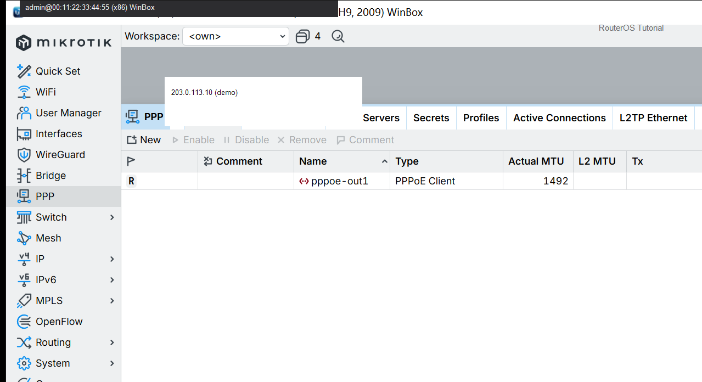

# 家庭路由器

> 适用版本：RouterOS 7.x  
> 管理工具：WinBox  
> 官方依据：[First Time Configuration](https://help.mikrotik.com/docs/spaces/ROS/pages/328183/First+Time+Configuration)

## 目的

家里最小可用：桥 + 地址 + DHCP + DNS + PPPoE + NAT。

## 网络

- 示例 LAN：`192.168.88.0/24`，网关 `192.168.88.1`，接口 `bridge`
- WAN 示例：`pppoe-out1` 或 `ether1`
- 密码示例：`********`（填你自己的）
- 身份示例：`R1`

## 第1步：接口与桥

WinBox：`Interfaces / Bridge`

动作：LAN 进 bridge。


```routeros
/interface/bridge/add name=bridge
/ip/address/add address=192.168.88.1/24 interface=bridge
```

## 第2步：上网与 NAT

WinBox：`PPP / Firewall NAT`

动作：拨号后 masquerade 出接口用 pppoe-out1。



```routeros
/ip/firewall/nat/add chain=srcnat out-interface=pppoe-out1 action=masquerade
```

## 检查

WinBox：电脑能上网

```routeros
/ping 1.1.1.1 count=3
```

## 常见问题

对照本仓库 901 实配骨架。
