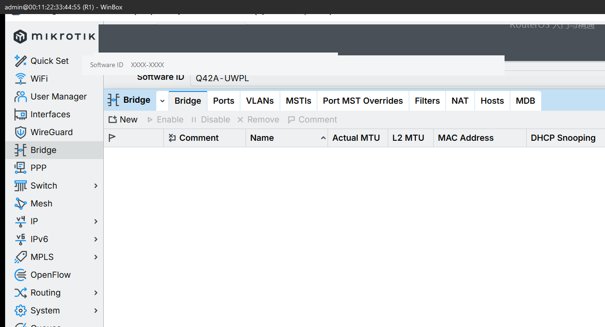

# 家庭路由器

> 适用版本：RouterOS 7.x  
> 管理工具：WinBox  
> 官方依据：[First Time Configuration](https://help.mikrotik.com/docs/spaces/ROS/pages/328151/First+Time+Configuration)

## 目的

按顺序：连接 → 地址 → DHCP → 上网（PPPoE或DHCP）→ NAT → 防火墙 → 备份。

## 网络

- 示例 LAN：`192.168.88.1/24`，接口 `bridge`（改成你的口）
- WAN 示例口：`ether1`
- 密码示例：`********`（填你自己的）

## 第1步：对照课表

WinBox：`左侧菜单`

不要一上来 Quick Set 填真实账号再截图上传。



```routeros
/export compact
```

## 检查

WinBox：`IP → Addresses`

```routeros
/ip/address/print
```

## 常见问题

拨号细节见 `pppoe-dial.md`。

