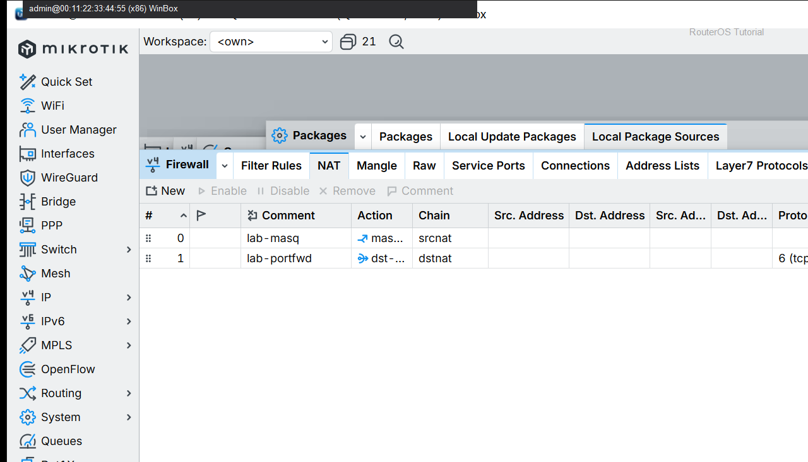

# 家庭路由器

> 适用版本：RouterOS 7.x  
> 管理工具：WinBox  
> 官方依据：[First Time Configuration](https://help.mikrotik.com/docs/spaces/ROS/pages/328151/First+Time+Configuration)

## 目的

家庭：桥接 LAN + 拨号/DHCP WAN + NAT + 基础防护。

## 网络

- 示例 LAN：`192.168.88.0/24`，网关 `192.168.88.1`，接口 `bridge`（改成你的口）
- WAN 示例：`pppoe-out1` 或 `ether1`
- 密码示例：`********`（填你自己的管理员密码）
- 身份示例：`R1`

## 第1步：确认 LAN

WinBox：`Bridge / IP → Addresses`

动作：bridge=192.168.88.1/24。


```routeros
/ip/address/print where interface=bridge
```

## 第2步：确认 NAT

WinBox：`IP → Firewall → NAT`

动作：有 masquerade。



```routeros
/ip/firewall/nat/print where action=masquerade
```

## 检查

WinBox：内网能上网

```routeros
/ip/firewall/nat/print
/ping 1.1.1.1 count=2
```

## 常见问题

先备份再改。
