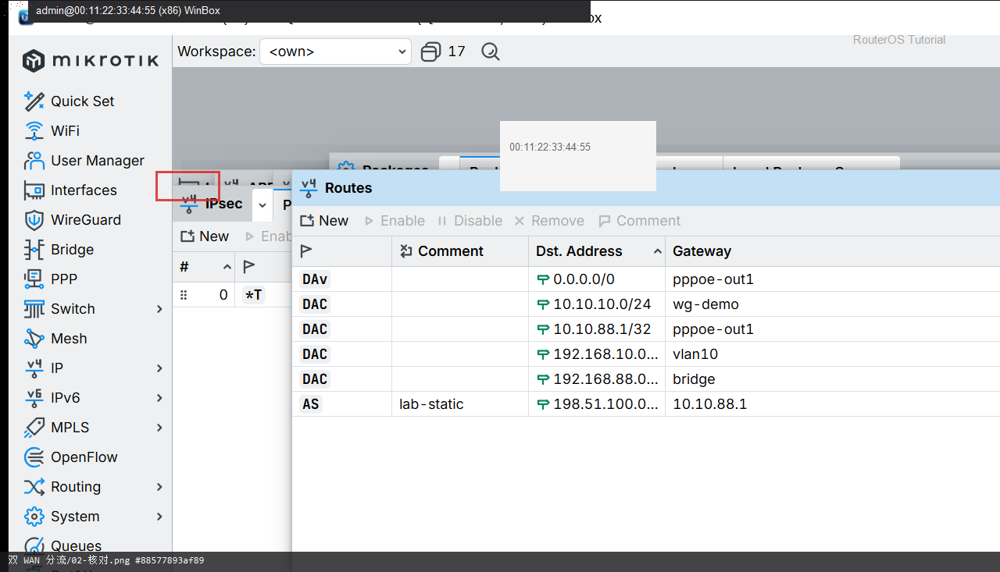

# 双 WAN 分流

> 适用版本：RouterOS 7.x  
> 管理工具：WinBox  
> 官方依据：[Routes](https://help.mikrotik.com/docs/spaces/ROS/pages/59968792/Routes)

## 目的

主备或策略分流。

## 网络

- 示例 LAN：`192.168.88.0/24`，网关 `192.168.88.1`，接口 `bridge`
- WAN 示例：`pppoe-out1` 或 `ether1`
- 密码示例：`********`（填你自己的）
- 身份示例：`R1`

## 第1步：双默认路由

WinBox：`IP → Routes`

动作：主 distance=1，备 distance=2。


```routeros
/ip/route/print where dst-address=0.0.0.0/0
```

## 第2步：核对 Active

WinBox：`IP → Routes`

动作：主线带 A；断主线后备线应升为 Active。



```routeros
/ip/route/add dst-address=0.0.0.0/0 gateway=ether2 distance=2 check-gateway=ping
```

## 检查

WinBox：主线 Active

```routeros
/ip/route/print where dst-address=0.0.0.0/0
```

## 常见问题

两条线各自要有 NAT。
