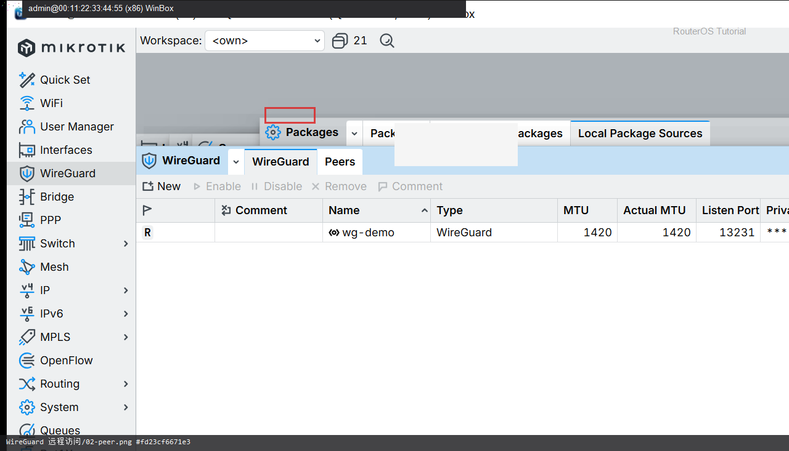

# WireGuard 远程访问

> 适用版本：RouterOS 7.x  
> 管理工具：WinBox  
> 官方依据：[WireGuard](https://help.mikrotik.com/docs/spaces/ROS/pages/69664792/WireGuard)

## 目的

回家办公最小 VPN。

## 网络

- 示例 LAN：`192.168.88.0/24`，网关 `192.168.88.1`，接口 `bridge`
- WAN 示例：`pppoe-out1` 或 `ether1`
- 密码示例：`********`（填你自己的）
- 身份示例：`R1`

## 第1步：建 wg-demo

WinBox：`WireGuard → +`

动作：Name=wg-demo，Listen Port=13231。


```routeros
/interface/wireguard/add name=wg-demo listen-port=13231
```

## 第2步：加地址与 Peer

WinBox：`IP → Addresses / WireGuard → Peers`

动作：Address=10.10.10.1/24；Peers 填手机公钥（文档用占位）。



```routeros
/ip/address/add address=10.10.10.1/24 interface=wg-demo
/interface/wireguard/peers/print
```

## 检查

WinBox：手机能进家里 LAN

```routeros
/interface/wireguard/peers/print
/ping 10.10.10.2 count=2
```

## 常见问题

光猫转发 UDP 13231。
