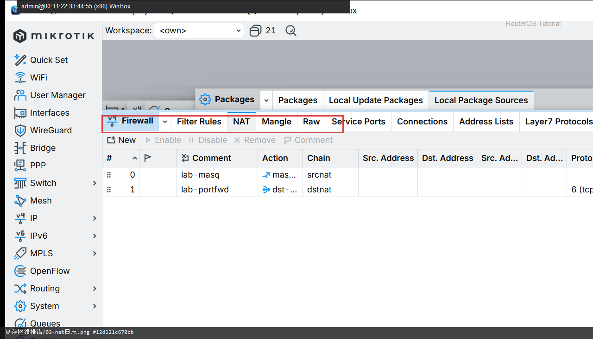

# 复杂网络排错

> 适用版本：RouterOS 7.x  
> 管理工具：WinBox  
> 官方依据：[Troubleshooting](https://help.mikrotik.com/docs/spaces/ROS/pages/328151/First+Time+Configuration)

## 目的

多层问题时按层回归。

## 网络

- 示例 LAN：`192.168.88.0/24`，网关 `192.168.88.1`，接口 `bridge`
- WAN 示例：`pppoe-out1` 或 `ether1`
- 密码示例：`********`（填你自己的）
- 身份示例：`R1`

## 第1步：接口与路由

WinBox：`Interfaces / IP → Routes`

动作：口是否 Running；有无 0.0.0.0/0。


```routeros
/interface/print
/ip/route/print where dst-address=0.0.0.0/0
```

## 第2步：NAT 与日志

WinBox：`IP → Firewall → NAT / Log`

动作：有 masquerade；看近期报错。



```routeros
/ip/firewall/nat/print
/log/print
/ping 1.1.1.1 count=3
```

## 检查

WinBox：定位到第一处异常

```routeros
/ping 1.1.1.1 count=3
```

## 常见问题

先备份再改。
