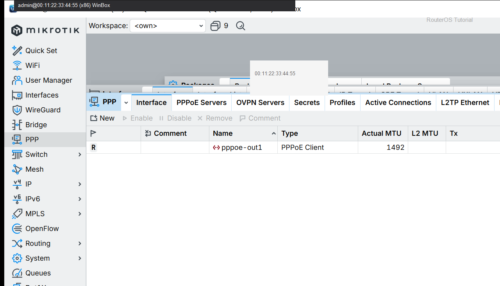
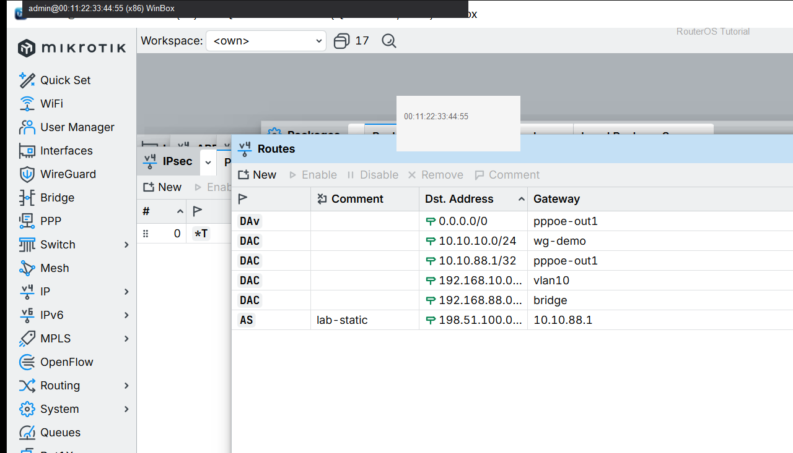

# PPPoE 拨号上网（对照）

> 适用版本：RouterOS 7.x  
> 管理工具：WinBox  
> 官方依据：[PPPoE](https://help.mikrotik.com/docs/spaces/ROS/pages/328147/PPPoE)

## 目的

家庭/小办公室用运营商账号拨号上网。完整逐步截图见主课。

## 网络

- WAN 口示例：`ether1`（不要加入 bridge）
- 拨号接口名：`pppoe-out1`
- 账号：填运营商给你的用户名；密码在 WinBox 里填，文档只写 `********`

## 第1步：打开 PPP

WinBox：`PPP → Interface`

动作：看是否已有 `pppoe-out1`。新建时 User 填运营商账号，Password 填 `********`。



```routeros
/interface/pppoe-client/print
```

## 第2步：确认地址与默认路由

WinBox：`IP → Addresses` / `IP → Routes`

动作：`pppoe-out1` 有动态地址，且存在 `0.0.0.0/0`。



```routeros
/ip/address/print where interface=pppoe-out1
/ip/route/print where dst-address=0.0.0.0/0
```

## 检查

WinBox：pppoe-out1 为 R，内网能上网。

```routeros
/interface/pppoe-client/print
/ping 1.1.1.1 count=2
```

## 常见问题

详细逐步与 NAT 见：[WAN 拨号 PPPoE](../../docs/04-NAT(nat)/01-WAN拨号PPPoE/01-WAN拨号PPPoE.md) · [Masquerade](../../docs/04-NAT(nat)/04-Masquerade/04-Masquerade.md)。
