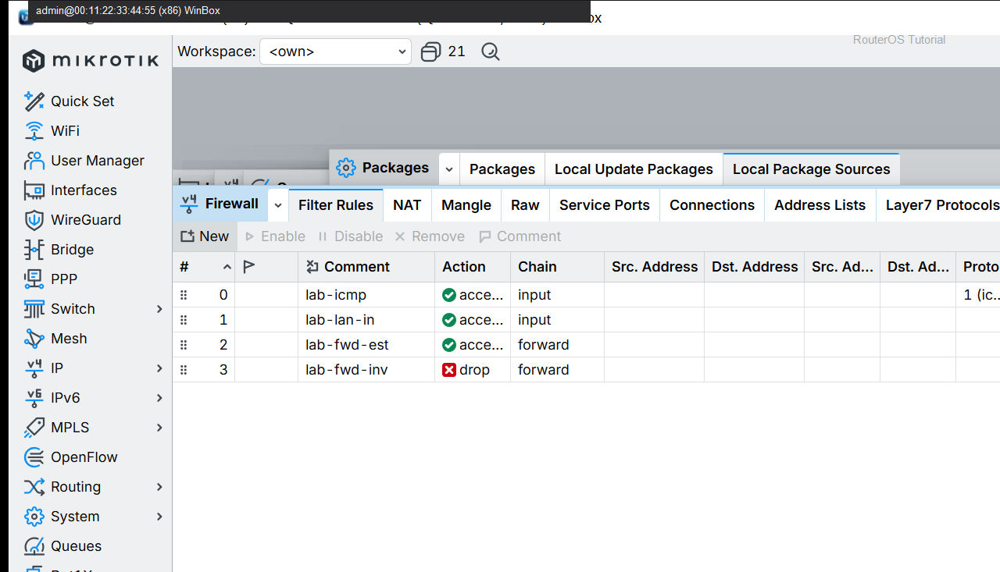

# 公司网络

> 适用版本：RouterOS 7.x  
> 管理工具：WinBox  
> 官方依据：[Filter](https://help.mikrotik.com/docs/spaces/ROS/pages/328166/Filter)

## 目的

公司：分段 + 防火墙 + 远程 VPN。

## 网络

- 示例 LAN：`192.168.88.0/24`，网关 `192.168.88.1`，接口 `bridge`（改成你的口）
- WAN 示例：`pppoe-out1` 或 `ether1`
- 密码示例：`********`（填你自己的管理员密码）
- 身份示例：`R1`

## 第1步：看地址与 VLAN

WinBox：`IP → Addresses`

动作：确认办公网段地址。


```routeros
/ip/address/print
```

## 第2步：看防火墙

WinBox：`IP → Firewall → Filter Rules`

动作：input/forward 有基本放行与丢弃。



```routeros
/ip/firewall/filter/print
```

## 检查

WinBox：办公网能上网且管理受限

```routeros
/ip/firewall/filter/print
/ip/address/print
```

## 常见问题

远程用 VPN，不裸开管理口。
