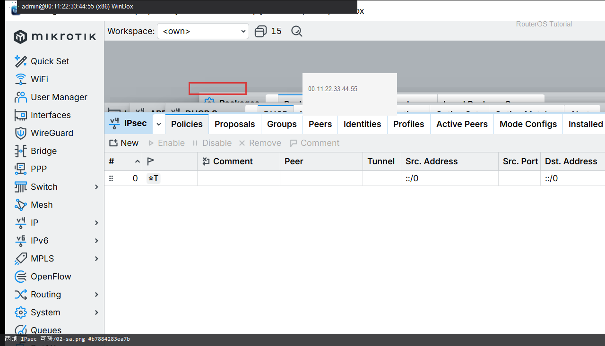

# 两地 IPsec 互联

> 适用版本：RouterOS 7.x  
> 管理工具：WinBox  
> 官方依据：[IPsec](https://help.mikrotik.com/docs/spaces/ROS/pages/121012236/IPsec)

## 目的

两地 LAN 互通。

## 网络

- 示例 LAN：`192.168.88.0/24`，网关 `192.168.88.1`，接口 `bridge`
- WAN 示例：`pppoe-out1` 或 `ether1`
- 密码示例：`********`（填你自己的）
- 身份示例：`R1`

## 第1步：打开 IPsec

WinBox：`IP → IPsec`

动作：认 Peers / Identities / Policies。


```routeros
/ip/ipsec/peer/print
```

## 第2步：看策略与 SA

WinBox：`IP → IPsec → Policies / Active Peers`

动作：两边 LAN 网段正确；连通后看 Installed SA。



```routeros
/ip/ipsec/policy/print
/ip/ipsec/installed-sa/print
```

## 检查

WinBox：Installed SA 正常

```routeros
/ip/ipsec/installed-sa/print
```

## 常见问题

家里更适合用 WireGuard。预共享密钥填在两台路由器上。
