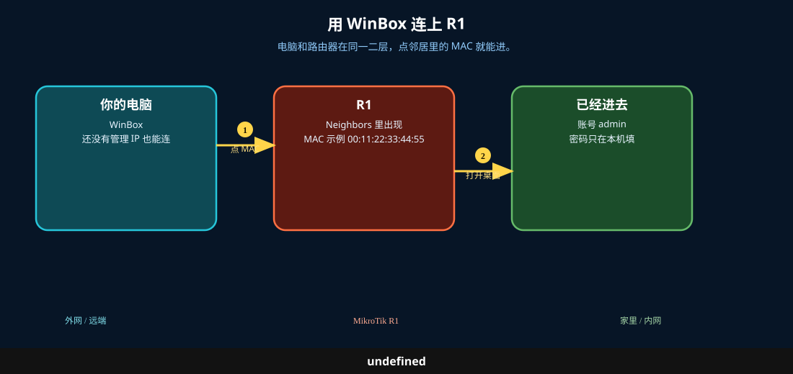
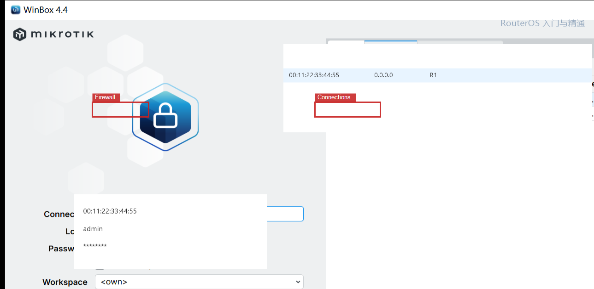
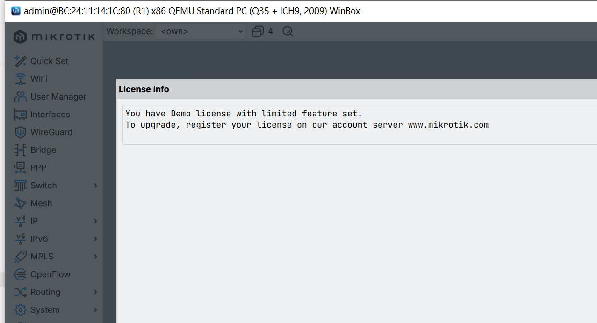

# 连接路由器

> 适用版本：RouterOS 7.x

## 目的

电脑用 WinBox 登进路由器。还没有管理 IP 时，用 Neighbors 里的 **MAC** 连。

## 网络

- 电脑网线接到路由器 **LAN 口**（不要插 ether1 当 WAN 的口）
- 还没配 IP 时，Neighbors 里 IP 可能是 `0.0.0.0`，这是正常的
- 登录：`admin` / 你自己的密码（教程里写成 `********`）
- 图中的 MAC 是示例 `00:11:22:33:44:55`，选你列表里那一台

## 先看懂

电脑和路由器在同一二层，点邻居里的 MAC 就能进。



## 第1步：打开 WinBox

到 [MikroTik 下载页](https://mikrotik.com/download) 下 WinBox（3 或 4 均可），双击运行。

点 **Neighbors**。



无设备命令。本机还没进路由器。

## 第2步：用 MAC 连接

WinBox：

1. 在 Neighbors 里点该设备的 **MAC Address**（IP 是 `0.0.0.0` 时不要点 IP）
2. `Login` 填 `admin`
3. `Password` 填你自己的密码；新机可能是空密码，第一次进去会要求改密
4. 点 **Connect**

进得去后，左边出现 `Interfaces`、`IP`、`System` 等菜单。



```routeros
/system/resource/print
/interface/print
```

## 检查

WinBox 标题栏应类似 `admin@…`。左侧能点开 `Interfaces`。

```routeros
/system/identity/print
```
