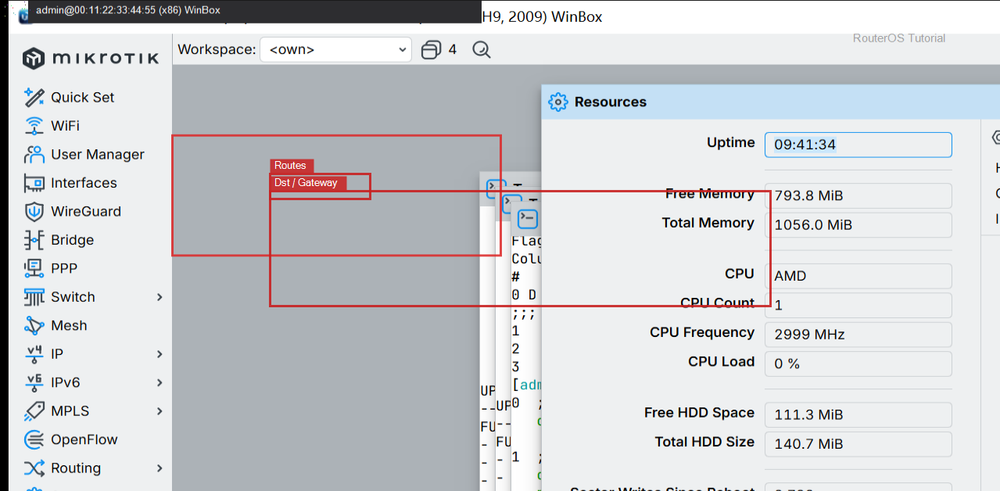

# 查看路由器信息

> 适用版本：RouterOS 7.x

## 目的

先看版本、CPU、内存和接口状态。

## 网络

- 示例 LAN：`192.168.88.0/24`，网关 `192.168.88.1`，接口 `bridge`（改成你的口）
- WAN 示例：`pppoe-out1` 或 `ether1`
- 密码示例：`********`（填你自己的管理员密码）
- 身份示例：`R1`

## 第1步：看 Resources

WinBox：`System → Resources`

动作：记下版本、CPU、空闲内存。



<p align="center">图(1) 看Resources</p>


```routeros
/system/resource/print
```

## 第2步：看 Interfaces

WinBox：`Interfaces`

动作：确认管理口/WAN/LAN 是否 Running。


<p align="center">图(2) 看Interfaces</p>


```routeros
/interface/print
```

## 检查

WinBox：能读出版本与接口状态

```routeros
/system/resource/print
/interface/print
```
