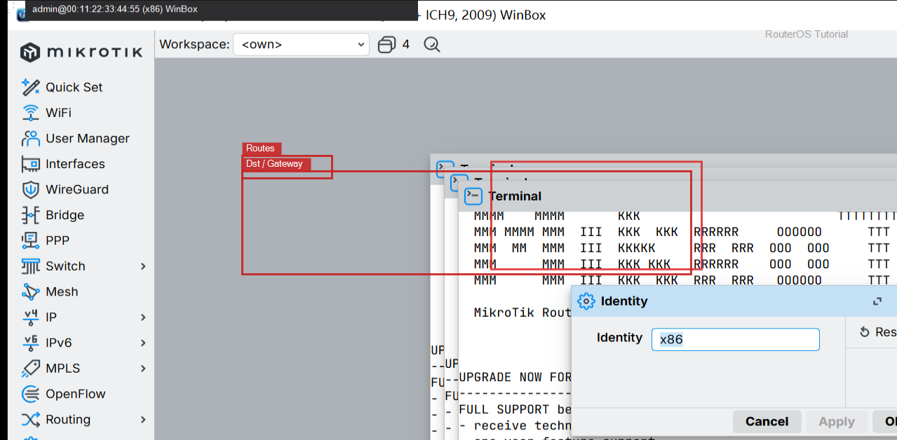
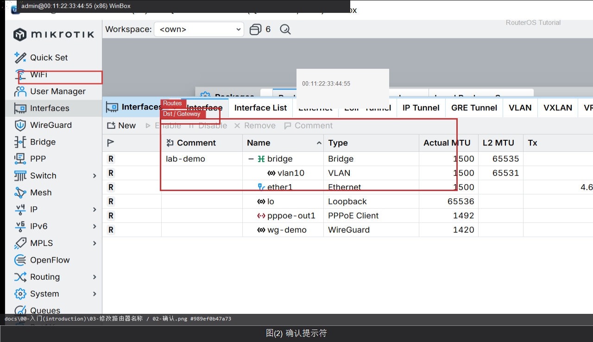

# 修改路由器名称

> 适用版本：RouterOS 7.x

## 目的

改成 R1，终端提示符更好认。

## 网络

- 示例 LAN：`192.168.88.0/24`，网关 `192.168.88.1`，接口 `bridge`（改成你的口）
- WAN 示例：`pppoe-out1` 或 `ether1`
- 密码示例：`********`（填你自己的管理员密码）
- 身份示例：`R1`

## 第1步：打开 Identity

WinBox：`System → Identity`

动作：打开 Identity 对话框，Name 填 R1，Apply/OK。



```routeros
/system/identity/set name=R1
```

## 第2步：确认提示符

WinBox：`New Terminal`

动作：看提示符是否为 [admin@R1]。



```routeros
/system/identity/print
```

## 检查

WinBox：提示符为 [admin@R1]

```routeros
/system/identity/print
```
