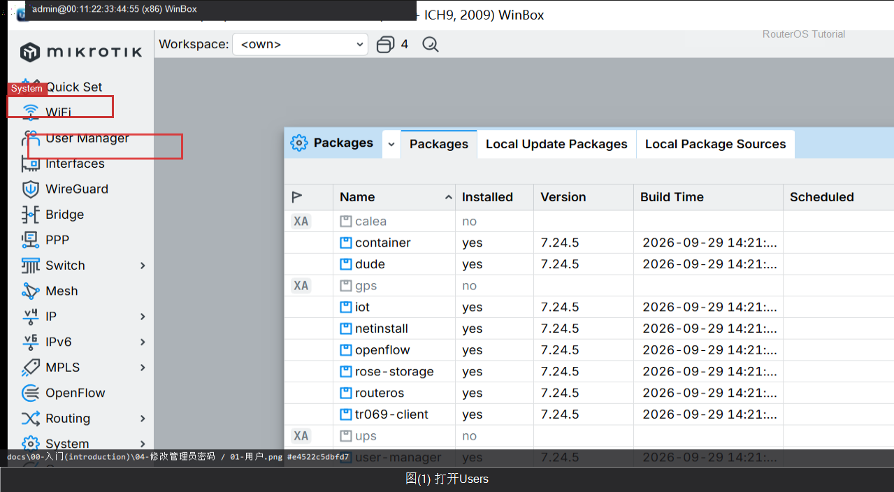
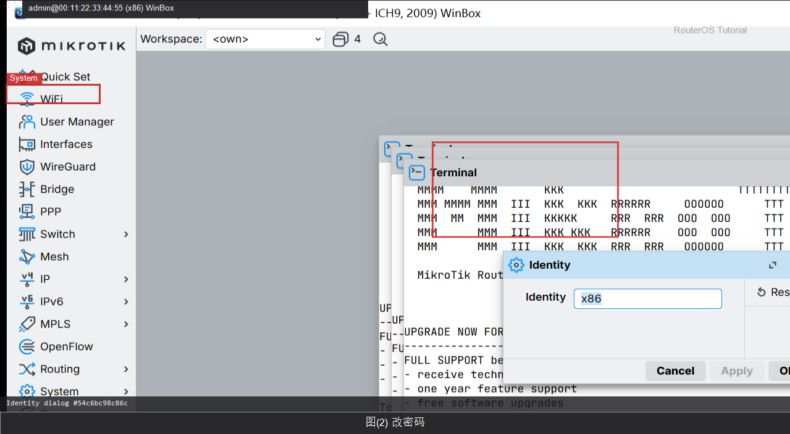

# 修改管理员密码

> 适用版本：RouterOS 7.x


## 目的

改掉默认/弱口令。

## 网络

- 示例 LAN：`192.168.88.0/24`，网关 `192.168.88.1`，接口 `bridge`（改成你的口）
- WAN 示例：`pppoe-out1` 或 `ether1`
- 密码示例：`********`（填你自己的管理员密码）
- 身份示例：`R1`

## 第1步：打开 Users

WinBox：`System → Users`

动作：双击 admin。



```routeros
/user/print
```

## 第2步：改密码

WinBox：`System → Users → admin`

动作：Password 填你自己的新密码（教程只写圆点/********），OK。不要把真实密码写进文档。



```routeros
/user/set [find name=admin] password=********
```

## 检查

WinBox：能用新密码重登

```routeros
/user/print
```
