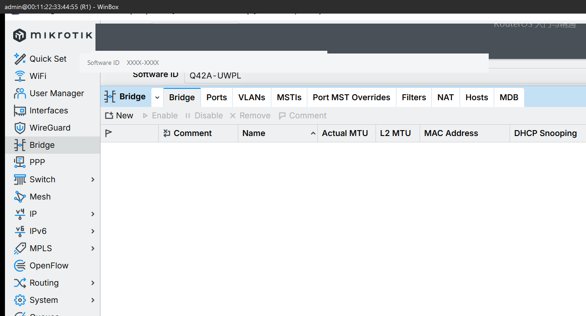
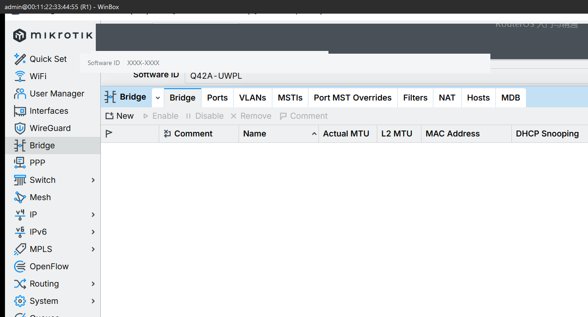

# 备份

> 适用版本：RouterOS 7.x  
> 管理工具：WinBox  
> 官方依据：[Backup](https://help.mikrotik.com/docs/spaces/ROS/pages/40960324/Backup)

## 目的

先做一份能 Restore 的备份。

## 网络

- 示例 LAN：`192.168.88.1/24`，接口 `bridge`（改成你的口）
- WAN 示例口：`ether1`
- 密码示例：`********`（填你自己的）

## 第1步：备份

WinBox：`Files → Backup`

Name 填 `r1-backup`，可设备份密码（可选），点 Backup。



```routeros
/system/backup/save name=r1-backup
```

## 第2步：导出文本

WinBox：`New Terminal`

导出给对照用（含明文密码，妥善保管）。



```routeros
/export file=r1-export
```

## 检查

WinBox：`Files`

```routeros
/file/print
```

## 常见问题

`backup` 能还原；`export` 方便阅读。不要提交到 git。

