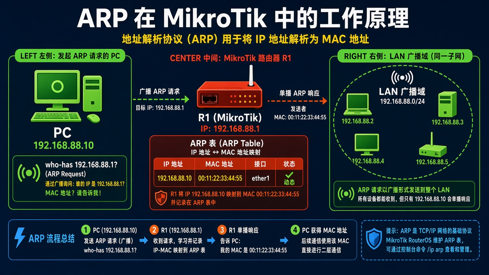

# 第 6 章：看清电脑和路由器怎么用 ARP 对上

> 适用版本：RouterOS 7.x

## 目的

看 IP 与 MAC 对应。

## 网络

- 示例 LAN：`192.168.88.0/24`，网关 `192.168.88.1`，接口 `bridge`（改成你的口）
- WAN 示例：`pppoe-out1` 或 `ether1`
- 密码示例：`********`（填你自己的管理员密码）
- 身份示例：`R1`

## 网络拓扑及原理图

同一网段通信前，先广播：谁是 192.168.88.1？



<p align="center">图(1) ARP</p>

## 第1步：打开 ARP

WinBox：`IP → ARP`

动作：查看 IP Address / MAC Address / Interface。


<p align="center">图(2) 打开ARP</p>


```routeros
/ip/arp/print
```

## 第2步：刷新观察

WinBox：`IP → ARP`

动作：内网通信后会出现动态条目。


<p align="center">图(3) 刷新观察</p>


```routeros
/ip/arp/print where dynamic
```

## 检查

WinBox：能看到邻居或为空（刚开机）

```routeros
/ip/arp/print
```
