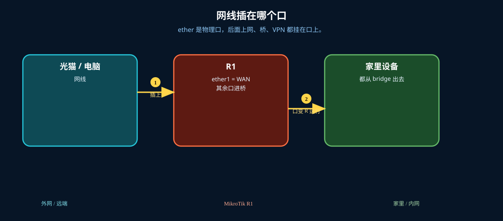
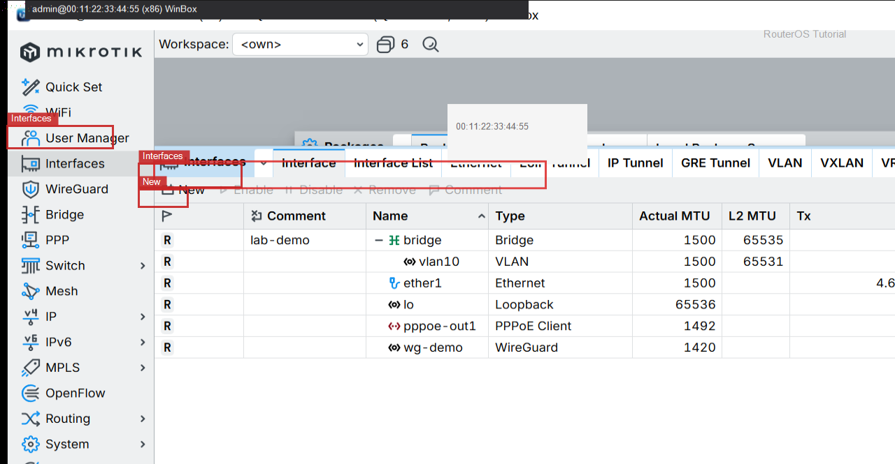

# 接口

> 适用版本：RouterOS 7.x

## 目的

分清物理口、桥、拨号口。

## 网络

- 示例 LAN：`192.168.88.0/24`，网关 `192.168.88.1`，接口 `bridge`（改成你的口）
- WAN 示例：`pppoe-out1` 或 `ether1`
- 密码示例：`********`（填你自己的管理员密码）
- 身份示例：`R1`

## 先看懂

ether 是物理口，后面上网、桥、VPN 都挂在口上。



## 第1步：打开 Interfaces

WinBox：`Interfaces`

动作：看 Name、Type、Running。


```routeros
/interface/print
```

## 第2步：看详情

WinBox：`Interfaces → 双击某口`

动作：确认 ether/pppoe/bridge 用途。



```routeros
/interface/print detail
```

## 检查

WinBox：管理口 Running

```routeros
/interface/print
```
