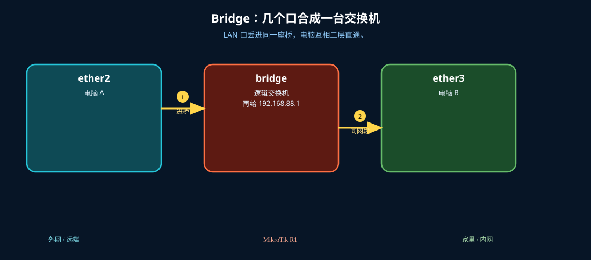
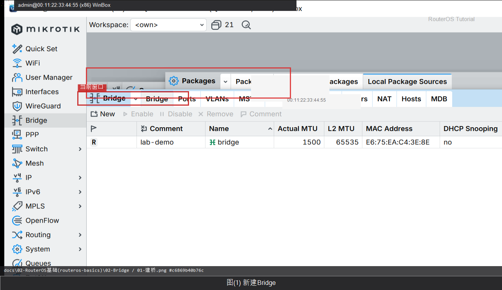
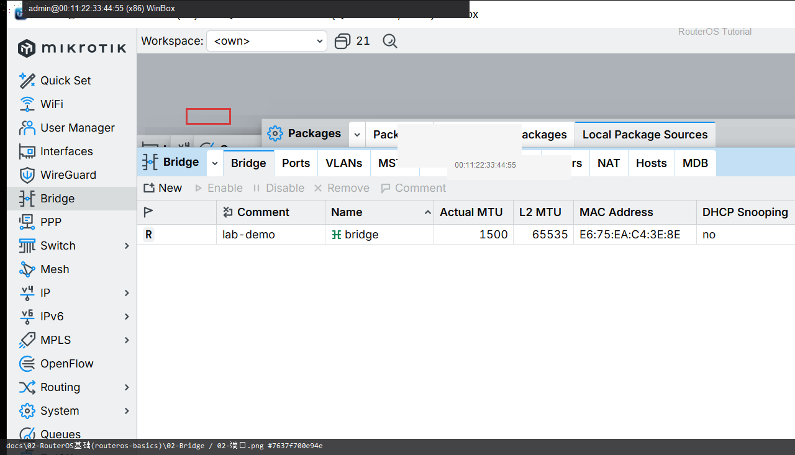

# Bridge

> 适用版本：RouterOS 7.x

## 目的

把多个口接到同一二层网桥。

## 网络

- 示例 LAN：`192.168.88.0/24`，网关 `192.168.88.1`，接口 `bridge`（改成你的口）
- WAN 示例：`pppoe-out1` 或 `ether1`
- 密码示例：`********`（填你自己的管理员密码）
- 身份示例：`R1`

## 先看懂

LAN 口丢进同一座桥，电脑互相二层直通。



<p align="center">图(1) Bridge</p>

## 第1步：新建 Bridge

WinBox：`Bridge → +`

动作：Name=bridge，Comment=lab-demo。



<p align="center">图(2) 新建Bridge</p>


```routeros
/interface/bridge/add name=bridge comment=lab-demo
```

## 第2步：加端口

WinBox：`Bridge → Ports → +`

动作：Interface 选 LAN 口，Bridge=bridge。



<p align="center">图(3) 加端口</p>


```routeros
/interface/bridge/port/add bridge=bridge interface=ether2
```

## 检查

WinBox：Bridge 为 R；Ports 有成员

```routeros
/interface/bridge/print
/interface/bridge/port/print
```
