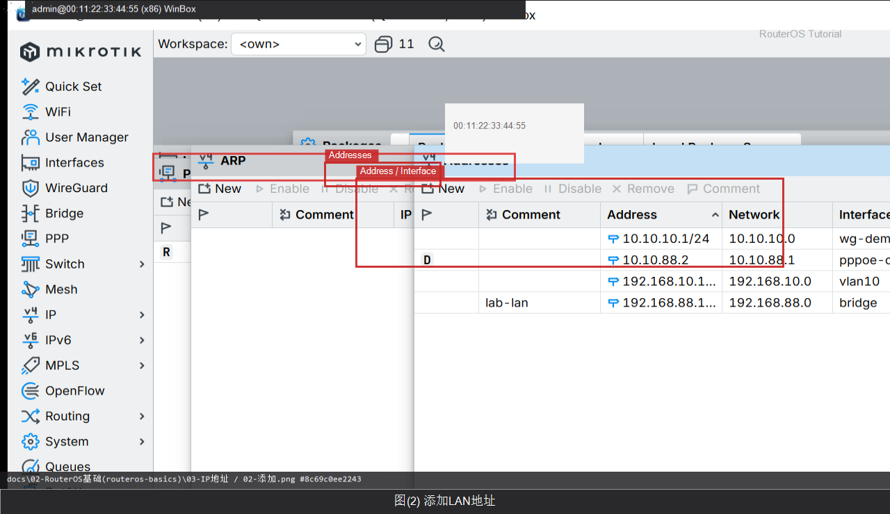

# IP 地址

> 适用版本：RouterOS 7.x


## 目的

给接口加管理地址。

## 网络

- 示例 LAN：`192.168.88.0/24`，网关 `192.168.88.1`，接口 `bridge`（改成你的口）
- WAN 示例：`pppoe-out1` 或 `ether1`
- 密码示例：`********`（填你自己的管理员密码）
- 身份示例：`R1`

## 第1步：打开 Addresses

WinBox：`IP → Addresses`

动作：看现有地址。


```routeros
/ip/address/print
```

## 第2步：添加 LAN 地址

WinBox：`IP → Addresses → +`

动作：Address=192.168.88.1/24，Interface=bridge。



```routeros
/ip/address/add address=192.168.88.1/24 interface=bridge
```

## 检查

WinBox：bridge 有 192.168.88.1/24

```routeros
/ip/address/print where interface=bridge
```
