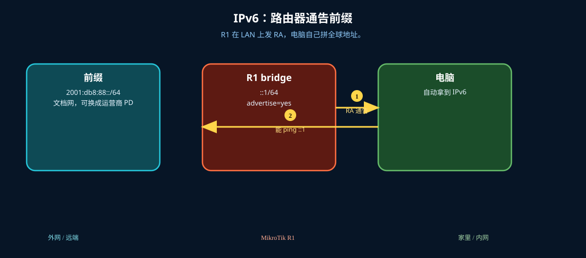
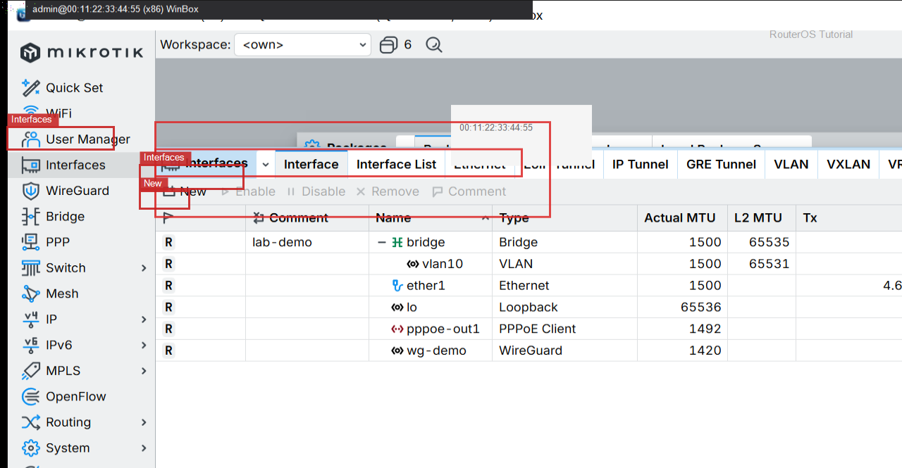

# 配置 IPv6

> 适用版本：RouterOS 7.x

## 目的

在 LAN 上启用 IPv6 地址并通告前缀（文档网段）。

## 网络

- LAN：`192.168.88.0/24`，网关 `192.168.88.1`，接口 `bridge`（改成你的口）
- WAN：`pppoe-out1` 或 `ether1`
- 公网示例用 TEST-NET：`203.0.113.10`；密码只写 `********`
- 身份示例：`R1`
- 示例前缀：`2001:db8:88::/64`（文档网，换成运营商给你的前缀或 DHCP-PD）

## 先看懂

R1 在 LAN 上发 RA，电脑自己拼全球地址。



<p align="center">图(0) IPv6</p>

## 第1步：打开 IPv6

WinBox：`IPv6 → Settings`

动作：Disable IPv6=no。


<p align="center">图(1) 打开IPv6</p>


```routeros
/ipv6/settings/set disable-ipv6=no
/ipv6/settings/print
```

## 第2步：给 bridge 加地址

WinBox：`IPv6 → Addresses → +`

动作：Address=2001:db8:88::1/64，Interface=bridge，Advertise=yes。


<p align="center">图(2) 给bridge加地址</p>


```routeros
/ipv6/address/add address=2001:db8:88::1/64 interface=bridge advertise=yes
```

## 第3步：核对 ND

WinBox：`IPv6 → ND`

动作：bridge 上要通告 RA，电脑才能自动拿到地址。



<p align="center">图(3) 核对ND</p>


```routeros
/ipv6/nd/print
/ipv6/address/print
```

## 第4步：IPv6 防火墙起步

WinBox：`IPv6 → Firewall → Filter Rules`

动作：至少放行 ICMPv6；不要对全网裸开管理口。


<p align="center">图(4) IPv6防火墙起步</p>


```routeros
/ipv6/firewall/filter/add chain=input protocol=icmpv6 action=accept comment=lab-icmp6
```

## 检查

WinBox：bridge 有 2001:db8:88::1/64；电脑能看到 IPv6

```routeros
/ipv6/address/print
/ipv6/nd/print
```

## 常见问题

容易忽略：运营商常用 DHCPv6-PD，拿到前缀后再加到 bridge。文档前缀不能上网。
