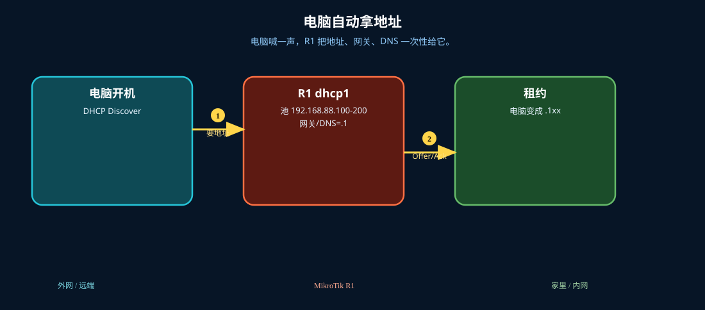

# DHCP 服务器

> 适用版本：RouterOS 7.x

## 目的

给内网发地址。

## 网络

- 示例 LAN：`192.168.88.0/24`，网关 `192.168.88.1`，接口 `bridge`（改成你的口）
- WAN 示例：`pppoe-out1` 或 `ether1`
- 密码示例：`********`（填你自己的管理员密码）
- 身份示例：`R1`

## 先看懂

电脑喊一声，R1 把地址、网关、DNS 一次性给它。



## 第1步：打开 DHCP Server

WinBox：`IP → DHCP Server`

动作：看是否已有 dhcp1。


```routeros
/ip/dhcp-server/print
```

## 第2步：核对 Network

WinBox：`IP → DHCP Server → Networks`

动作：Address=192.168.88.0/24，Gateway=192.168.88.1。


```routeros
/ip/dhcp-server/network/print
```

## 检查

WinBox：dhcp1 启用

```routeros
/ip/dhcp-server/print
/ip/dhcp-server/network/print
```
