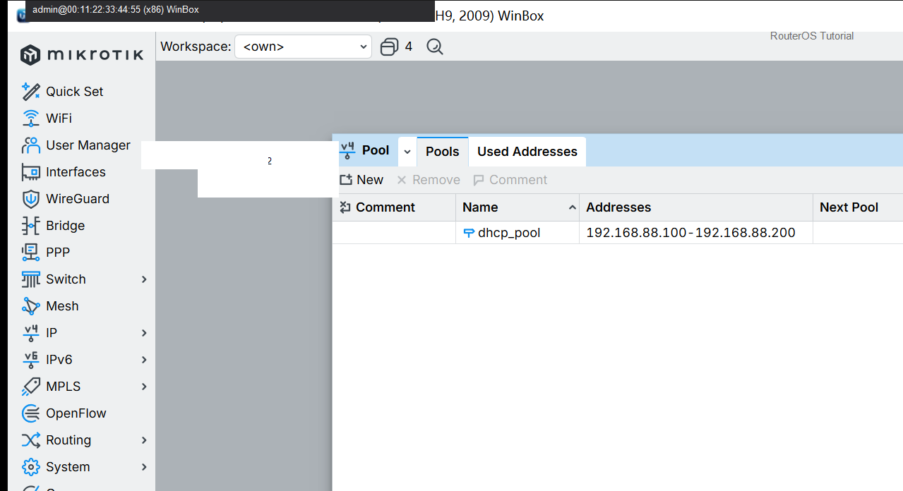
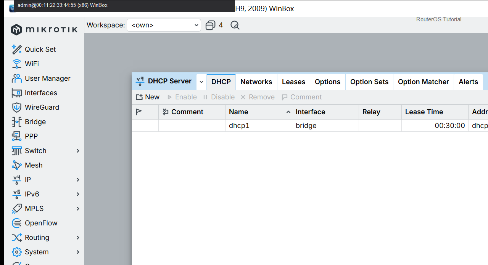

# DHCP 服务器

> 适用版本：RouterOS 7.x  
> 管理工具：WinBox  
> 官方依据：[DHCP](https://help.mikrotik.com/docs/spaces/ROS/pages/24805500/DHCP)

## 目的

电脑插在 LAN 自动拿地址。

## 网络

- 示例 LAN：`192.168.88.0/24`，网关 `192.168.88.1`，接口 `bridge`（改成你的口）
- WAN 示例：`pppoe-out1` 或 `ether1`
- 密码示例：`********`（填你自己的管理员密码）
- 身份示例：`R1`

## 第1步：建地址池

WinBox：`IP → Pool → +`

动作：Name=dhcp_pool，Addresses=192.168.88.100-192.168.88.200。



```routeros
/ip/pool/add name=dhcp_pool ranges=192.168.88.100-192.168.88.200
```

## 第2步：建 DHCP Server

WinBox：`IP → DHCP Server → +`

动作：Name=dhcp1，Interface=bridge，Address Pool=dhcp_pool。901 已实配。



```routeros
/ip/dhcp-server/add name=dhcp1 interface=bridge address-pool=dhcp_pool
/ip/dhcp-server/network/add address=192.168.88.0/24 gateway=192.168.88.1 dns-server=192.168.88.1
```

## 检查

WinBox：DHCP Server 有 dhcp1

```routeros
/ip/dhcp-server/print
```

## 常见问题

电脑要连在 bridge 端口上。
