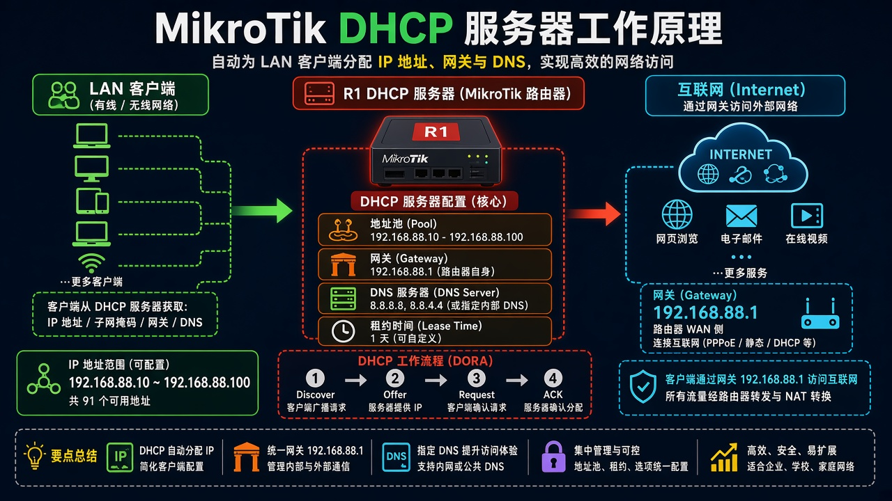

# 电脑自动拿地址

> 适用版本：RouterOS 7.x

## 目的

家里电脑自动拿到地址、网关和 DNS，能打开网页。

## 网络

- 示例 LAN：`192.168.88.0/24`，网关 `192.168.88.1`，接口 `bridge`（改成你的口）
- WAN 示例：`pppoe-out1` 或 `ether1`
- 密码示例：`********`（填你自己的管理员密码）
- 身份示例：`R1`

## 先看懂

电脑喊一声，R1 把地址、网关、DNS 一次性给它。



<p align="center">图(1) DHCP服务器</p>

## 第1步：打开 DHCP Server

WinBox：`IP → DHCP Server`

动作：看是否已有 dhcp1。


<p align="center">图(2) 打开DHCPServer</p>


```routeros
/ip/dhcp-server/print
```

## 第2步：核对 Network

WinBox：`IP → DHCP Server → Networks`

动作：Address=192.168.88.0/24，Gateway=192.168.88.1。


<p align="center">图(3) 核对Network</p>


```routeros
/ip/dhcp-server/network/print
```

## 第3步：开 DNS 转发

WinBox：`IP → DNS`

动作：Servers=`1.1.1.1`，Allow Remote Requests 勾上（只给家里网用）。DHCP Network 的 DNS 填 `192.168.88.1`。

```routeros
/ip/dns/set allow-remote-requests=yes servers=1.1.1.1
/ip/dhcp-server/network/set [find address="192.168.88.0/24"] dns-server=192.168.88.1
```

## 检查

WinBox：dhcp1 启用；电脑能拿到地址并能打开网页

```routeros
/ip/dhcp-server/print
/ip/dhcp-server/network/print
/ip/dns/print
```
