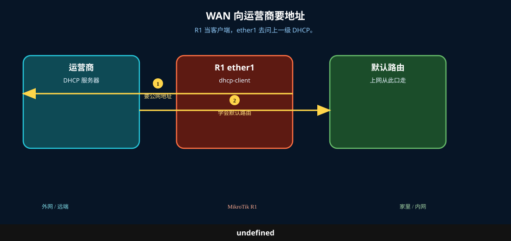
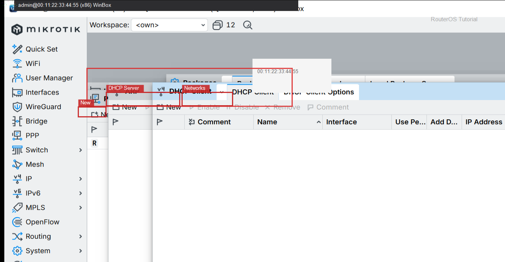
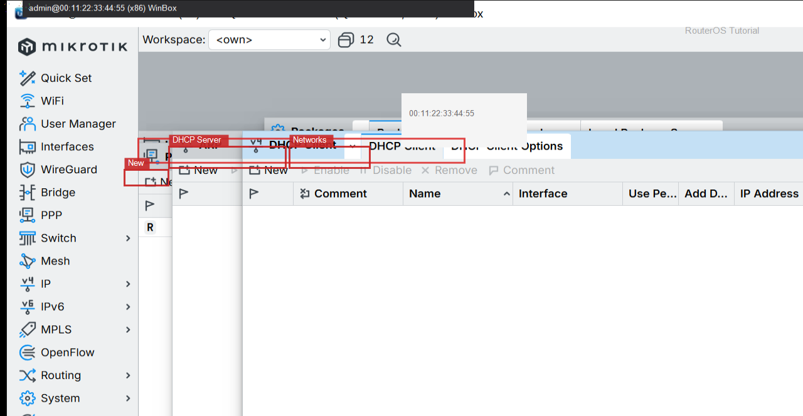

# DHCP 客户端

> 适用版本：RouterOS 7.x

## 目的

WAN 口用 DHCP 拿地址。

## 网络

- 示例 LAN：`192.168.88.0/24`，网关 `192.168.88.1`，接口 `bridge`（改成你的口）
- WAN 示例：`pppoe-out1` 或 `ether1`
- 密码示例：`********`（填你自己的管理员密码）
- 身份示例：`R1`

## 先看懂

R1 当客户端，ether1 去问上一级 DHCP。



<p align="center">图(0) DHCP客户端</p>

## 第1步：打开 DHCP Client

WinBox：`IP → DHCP Client`

动作：看 Interface、Status。



<p align="center">图(1) 打开DHCPClient</p>


```routeros
/ip/dhcp-client/print
```

## 第2步：添加客户端

WinBox：`IP → DHCP Client → +`

动作：Interface=ether1（示例），Add Default Route=yes。



<p align="center">图(2) 添加客户端</p>


```routeros
/ip/dhcp-client/add interface=ether1 add-default-route=yes
```

## 检查

WinBox：Status=bound 或已有动态地址

```routeros
/ip/dhcp-client/print
/ip/address/print where dynamic
```
