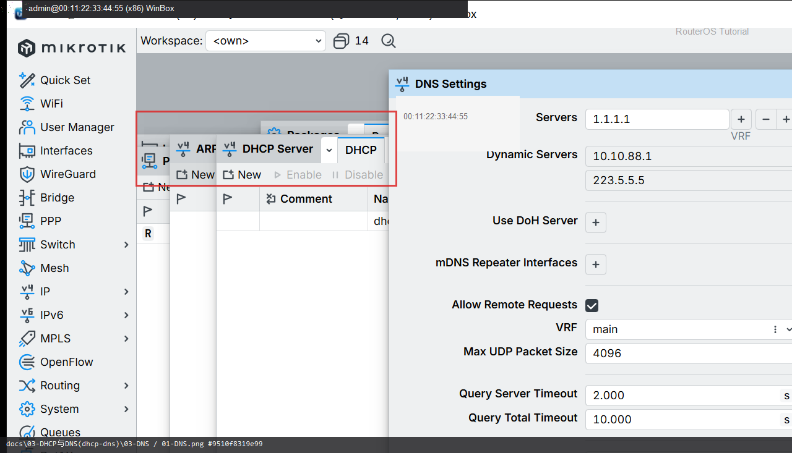
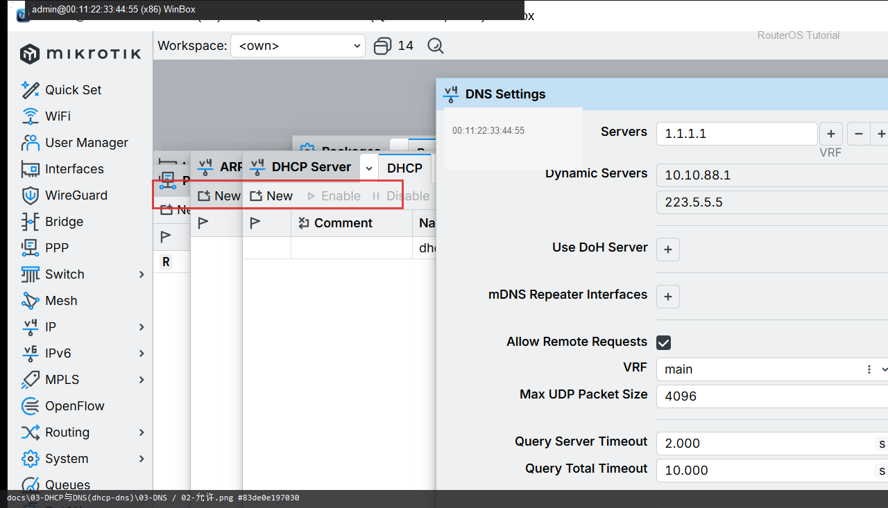

# DNS

> 适用版本：RouterOS 7.x  
> 管理工具：WinBox  
> 官方依据：[DNS](https://help.mikrotik.com/docs/spaces/ROS/pages/37748767/DNS)

## 目的

路由器转发 DNS。

## 网络

- 示例 LAN：`192.168.88.0/24`，网关 `192.168.88.1`，接口 `bridge`（改成你的口）
- WAN 示例：`pppoe-out1` 或 `ether1`
- 密码示例：`********`（填你自己的管理员密码）
- 身份示例：`R1`

## 第1步：打开 DNS

WinBox：`IP → DNS`

动作：Servers 填公共 DNS（示例 1.1.1.1）。



```routeros
/ip/dns/print
```

## 第2步：开远程请求

WinBox：`IP → DNS`

动作：Allow Remote Requests=yes（仅可信网段时）。



```routeros
/ip/dns/set allow-remote-requests=yes servers=1.1.1.1
```

## 检查

WinBox：能解析域名

```routeros
/ip/dns/print
/ping www.mikrotik.com count=2
```

## 常见问题

公网不要裸开 DNS。
