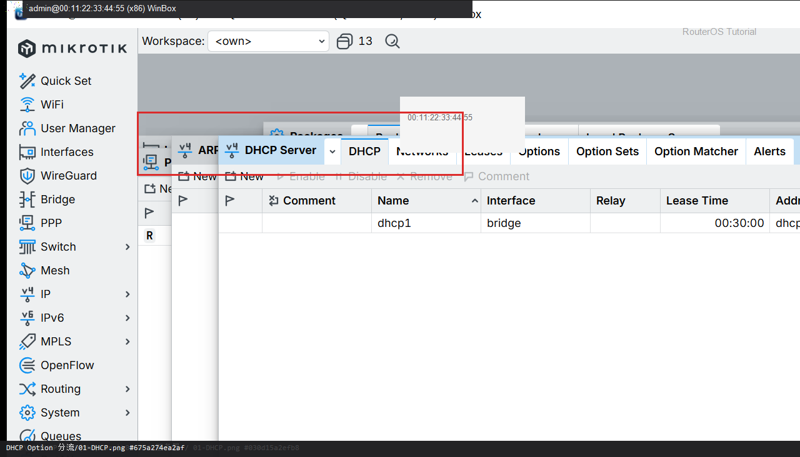
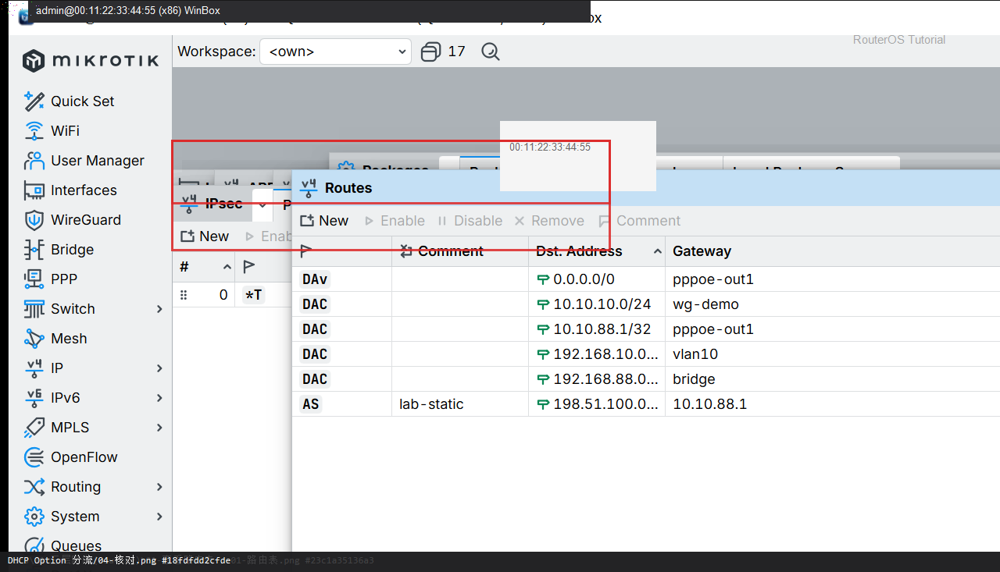

# DHCP Option 分流

> 适用版本：RouterOS 7.x  
> 管理工具：WinBox  
> 官方依据：[DHCP](https://help.mikrotik.com/docs/spaces/ROS/pages/24805500/DHCP)

## 目的

用 DHCP option 121（无类静态路由）让电脑把指定网段走另一网关。

## 网络

- LAN：`192.168.88.0/24`，网关 `192.168.88.1`，接口 `bridge`（改成你的口）
- WAN：`pppoe-out1` 或 `ether1`
- 公网示例用 TEST-NET：`203.0.113.10`；密码只写 `********`
- 身份示例：`R1`
- 电脑仍从 `192.168.88.1` 拿地址
- 额外路由：`10.0.0.0/8` 下一跳 `192.168.88.2`（示例）

## 第1步：打开 DHCP Server

WinBox：`IP → DHCP Server`

动作：先确认已有 dhcp1 和 network 192.168.88.0/24。



```routeros
/ip/dhcp-server/print
/ip/dhcp-server/network/print
```

## 第2步：添加 option 121

WinBox：`IP → DHCP Server → Options → +`

动作：Name=classless，Code=121。官方示例把 160.0.0.0/24 和默认路由推给客户端。本课推 10.0.0.0/8 via 192.168.88.2：value=`0x080AC0A85802`。


```routeros
/ip/dhcp-server/option/add name=classless code=121 value=0x080AC0A85802
```

## 第3步：挂到 Network

WinBox：`IP → DHCP Server → Networks`

动作：该网段的 DHCP Option 勾选 classless。Windows 会请求 121；有的客户端不请求则加 force=yes。


```routeros
/ip/dhcp-server/network/set [find address=192.168.88.0/24] dhcp-option=classless
```

## 第4步：电脑重新租约

WinBox：`电脑 ipconfig /renew`

动作：看电脑路由表是否出现 10.0.0.0/8。路由器上 print option 的 raw-value。



```routeros
/ip/dhcp-server/option/print detail
/ip/dhcp-server/lease/print
```

## 检查

WinBox：option 有 raw-value；电脑路由表有分流网段

```routeros
/ip/dhcp-server/option/print detail
/ip/dhcp-server/network/print
```

## 常见问题

RFC：客户端 Parameter-List 不含 121 时服务器默认不发。v7.1rc5 起可 force=yes。编码错会导致整段 option 无效。
