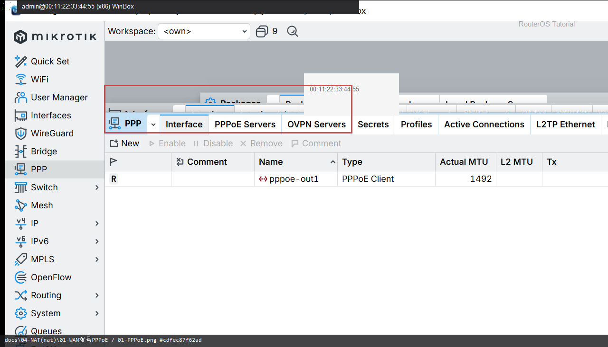
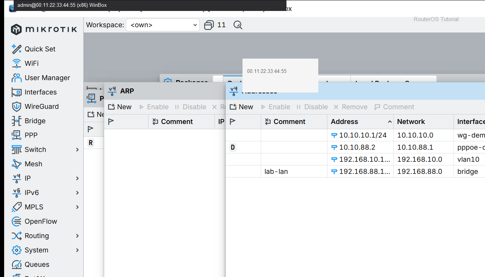

# 第 11 章：让 RouterOS 用宽带账号拨号上网

> 适用版本：RouterOS 7.x

## 目的

用运营商账号拨号，家里电脑能上网。

## 网络

- 示例 LAN：`192.168.88.0/24`，网关 `192.168.88.1`，接口 `bridge`（改成你的口）
- WAN 示例：`pppoe-out1` 或 `ether1`
- 密码示例：`********`（填你自己的管理员密码）
- 身份示例：`R1`
- 宽带账号、密码填你自己的（课文用 `ISP_USER` 举例）


## 网络拓扑及原理图

R1 拿运营商账号，在 WAN 上长出一个 pppoe-out1。


<p align="center">图(1) PPPoE拨号</p>

## 第1步：打开 PPP

WinBox：`PPP → Interface`

动作：看是否已有 pppoe-out1。宽带账号、密码填你自己的。



<p align="center">图(2) 打开PPP</p>


```routeros
/interface/pppoe-client/print
```

## 第2步：确认拿址

WinBox：`IP → Addresses`

动作：pppoe-out1 上有动态地址。



<p align="center">图(3) 确认拿址</p>


```routeros
/ip/address/print where interface=pppoe-out1
```

## 第3步：内网共享上网

WinBox：`IP → Firewall → NAT → +`

动作：Chain=`srcnat`，Out. Interface=`pppoe-out1`，Action=`masquerade`，Comment=`lab-masq`。

```routeros
/ip/firewall/nat/add chain=srcnat out-interface=pppoe-out1 action=masquerade comment=lab-masq
```

## 检查

WinBox：pppoe-out1 Running 且有地址；NAT 有 lab-masq；电脑能打开网页

```routeros
/interface/pppoe-client/print
/ip/address/print where interface=pppoe-out1
/ip/firewall/nat/print where comment=lab-masq
```
