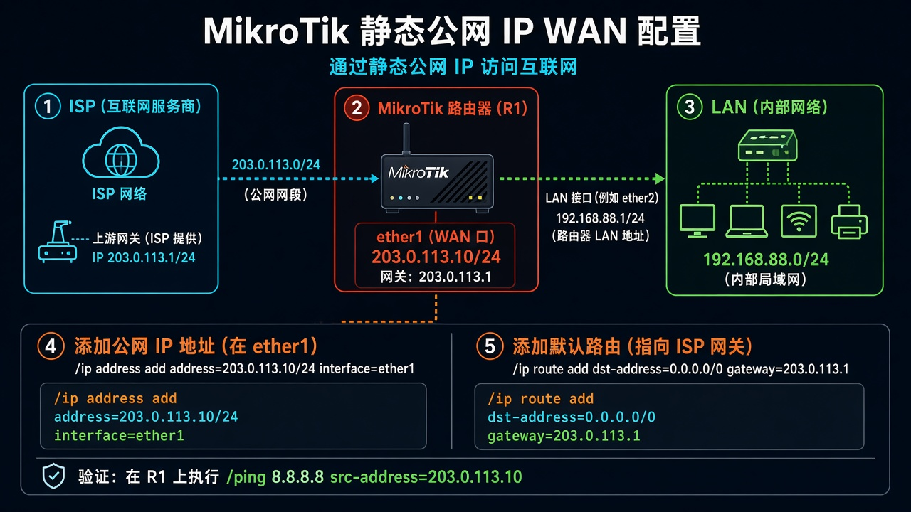

# 第 12 课：让 RouterOS 用固定公网 IP 上网

> 适用版本：RouterOS 7.x

## 目的

WAN 配静态地址并写默认路由。

## 网络

- 示例 LAN：`192.168.88.0/24`，网关 `192.168.88.1`，接口 `bridge`（改成你的口）
- WAN 示例：`pppoe-out1` 或 `ether1`
- 密码示例：`********`（填你自己的管理员密码）
- 身份示例：`R1`
- WAN 示例用 TEST-NET：`203.0.113.10/30`，网关 `203.0.113.9`


## 网络拓扑及原理图

WAN 口直接填地址，再加一条默认路由。



<p align="center">图(1) 固定IP</p>

## 第1步：配 WAN 地址

WinBox：`IP → Addresses → +`

动作：Address=运营商地址/掩码，Interface=ether1（示例）。


<p align="center">图(2) 配WAN地址</p>


```routeros
/ip/address/add address=203.0.113.10/30 interface=ether1
```

## 第2步：默认路由

WinBox：`IP → Routes → +`

动作：Dst=0.0.0.0/0，Gateway=运营商网关。


<p align="center">图(3) 默认路由</p>


```routeros
/ip/route/add dst-address=0.0.0.0/0 gateway=203.0.113.9
```

## 第3步：内网共享上网

WinBox：`IP → Firewall → NAT → +`

动作：Chain=`srcnat`，Out. Interface=`ether1`，Action=`masquerade`，Comment=`lab-masq`。

```routeros
/ip/firewall/nat/add chain=srcnat out-interface=ether1 action=masquerade comment=lab-masq
```

## 检查

WinBox：有默认路由、NAT 有 lab-masq、电脑能打开网页

```routeros
/ip/route/print where dst-address=0.0.0.0/0
/ip/firewall/nat/print where comment=lab-masq
```
