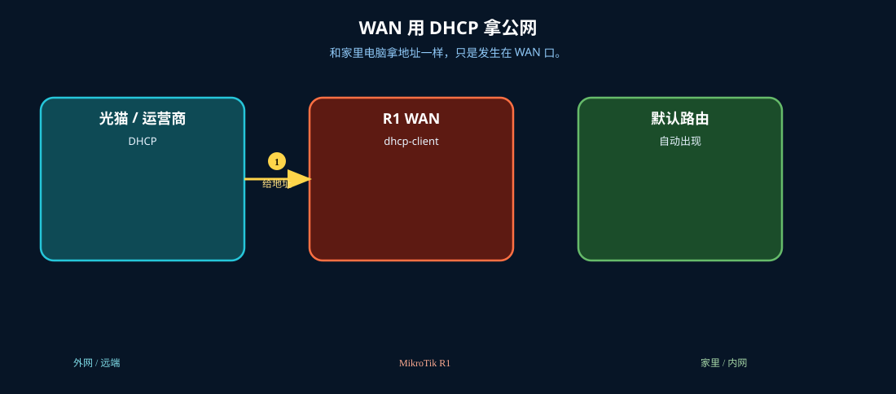
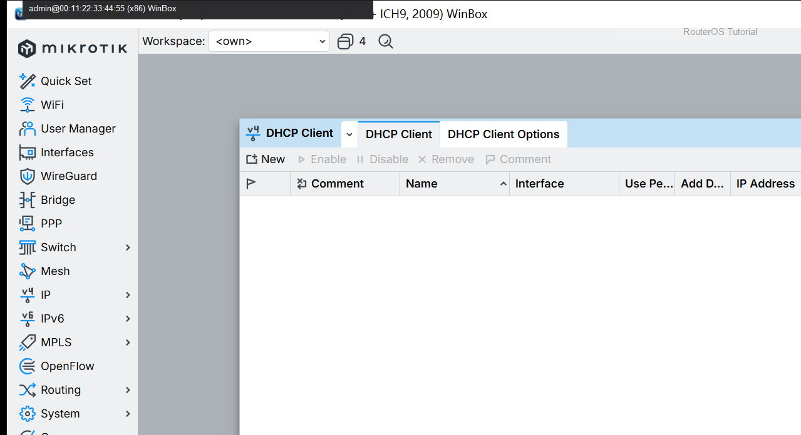

# DHCP 获取公网 IP

> 适用版本：RouterOS 7.x

## 目的

WAN 口 DHCP 拿公网/上联地址。

## 网络

- 示例 LAN：`192.168.88.0/24`，网关 `192.168.88.1`，接口 `bridge`（改成你的口）
- WAN 示例：`pppoe-out1` 或 `ether1`
- 密码示例：`********`（填你自己的管理员密码）
- 身份示例：`R1`

## 先看懂

和家里电脑拿地址一样，只是发生在 WAN 口。



<p align="center">图(1) WAN DHCP</p>

## 第1步：打开 DHCP Client

WinBox：`IP → DHCP Client`

动作：Interface 选 WAN 口。



<p align="center">图(2) 打开DHCPClient</p>


```routeros
/ip/dhcp-client/print
```

## 第2步：确认地址与路由

WinBox：`IP → Addresses / Routes`

动作：动态地址出现，且有默认路由。


<p align="center">图(3) 确认地址与路由</p>


```routeros
/ip/dhcp-client/print
/ip/route/print where dst-address=0.0.0.0/0
```

## 检查

WinBox：Client bound 且有默认路由

```routeros
/ip/dhcp-client/print
/ip/route/print where dst-address=0.0.0.0/0
```
