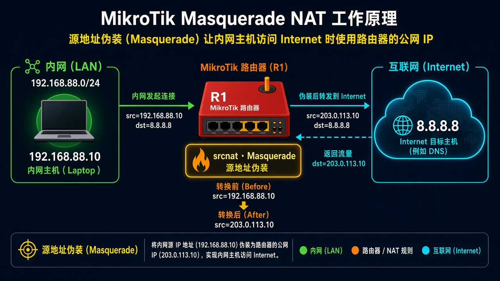
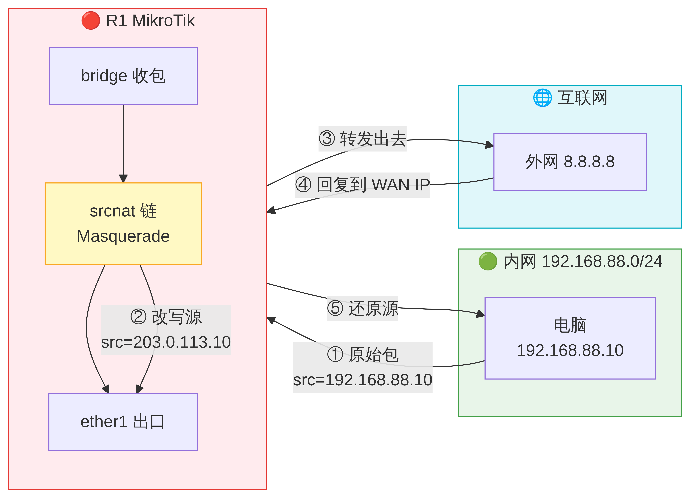

# Masquerade

> 适用版本：RouterOS 7.x

## 目的

内网共享上网。

## 网络

- 示例 LAN：`192.168.88.0/24`，网关 `192.168.88.1`，接口 `bridge`（改成你的口）
- WAN 示例：`pppoe-out1` 或 `ether1`
- 密码示例：`********`（填你自己的管理员密码）
- 身份示例：`R1`

## 先看懂

家里私网地址不能上公网，R1 把源地址换成 WAN 口。



<p align="center">图(1) Masquerade</p>



<p align="center">图(2) 数据包变形</p>


``
``

## 第1步：打开 NAT

WinBox：`IP → Firewall → NAT`

动作：确认在 NAT 页签（不是 Filter Rules）。


<p align="center">图(3) 打开NAT</p>


```routeros
/ip/firewall/nat/print
```

## 第2步：添加 masquerade

WinBox：`IP → Firewall → NAT → +`

动作：Chain=srcnat，Out. Interface=pppoe-out1，Action=masquerade，Comment=lab-masq。


<p align="center">图(4) 添加masquerade</p>


```routeros
/ip/firewall/nat/add chain=srcnat out-interface=pppoe-out1 action=masquerade comment=lab-masq
```

## 检查

WinBox：NAT 有 lab-masq

```routeros
/ip/firewall/nat/print where comment=lab-masq
```
