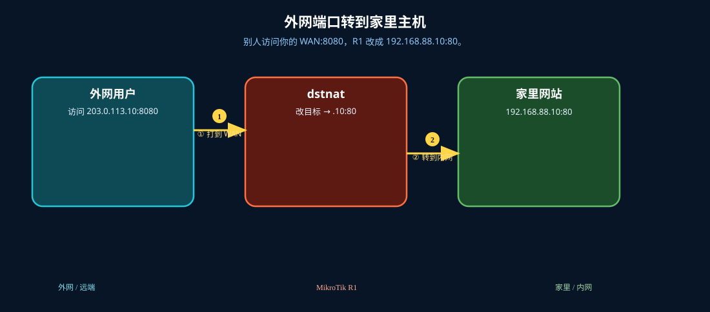

# DST-NAT 端口转发

> 适用版本：RouterOS 7.x

## 目的

把公网端口转到内网主机。

## 网络

- 示例 LAN：`192.168.88.0/24`，网关 `192.168.88.1`，接口 `bridge`（改成你的口）
- WAN 示例：`pppoe-out1` 或 `ether1`
- 密码示例：`********`（填你自己的管理员密码）
- 身份示例：`R1`

## 先看懂

别人访问你的 WAN:8080，R1 改成 192.168.88.10:80。




## 第1步：打开 NAT 列表

WinBox：`IP → Firewall → NAT`

动作：先看到现有 NAT 规则。


```routeros
/ip/firewall/nat/print
```

## 第2步：添加 dst-nat

WinBox：`IP → Firewall → NAT → +`

动作：Chain=dstnat，Protocol=tcp，Dst. Port=8080，In. Interface=pppoe-out1，Action=dst-nat，To Addresses=192.168.88.10，Comment=lab-portfwd。


```routeros
/ip/firewall/nat/add chain=dstnat protocol=tcp dst-port=8080 in-interface=pppoe-out1 action=dst-nat to-addresses=192.168.88.10 comment=lab-portfwd
```

## 检查

WinBox：NAT 有 lab-portfwd

```routeros
/ip/firewall/nat/print where comment=lab-portfwd
```
