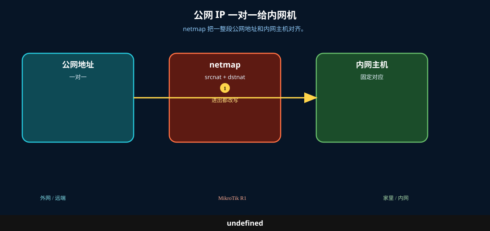

# 1 对 1 NAT

> 适用版本：RouterOS 7.x

## 目的

公网地址与内网主机一一映射（netmap）。

## 网络

- 示例 LAN：`192.168.88.0/24`，网关 `192.168.88.1`，接口 `bridge`（改成你的口）
- WAN 示例：`pppoe-out1` 或 `ether1`
- 密码示例：`********`（填你自己的管理员密码）
- 身份示例：`R1`
- 示例公网用 TEST-NET：`203.0.113.10`


## 先看懂

netmap 把一整段公网地址和内网主机对齐。



<p align="center">图(0) 1对1 NAT</p>

## 第1步：打开 NAT

WinBox：`IP → Firewall → NAT`

动作：准备添加 netmap 规则（示例用测试网段）。


<p align="center">图(1) 打开NAT</p>


```routeros
/ip/firewall/nat/print
```

## 第2步：添加 netmap

WinBox：`IP → Firewall → NAT → +`

动作：Chain=srcnat，Src. Address=192.168.88.10，Action=netmap，To Addresses=203.0.113.10（示例）。


<p align="center">图(2) 添加netmap</p>


```routeros
/ip/firewall/nat/add chain=srcnat src-address=192.168.88.10 action=netmap to-addresses=203.0.113.10 comment=lab-netmap
```

## 检查

WinBox：规则存在（演示可禁用）

```routeros
/ip/firewall/nat/print where comment=lab-netmap
```
