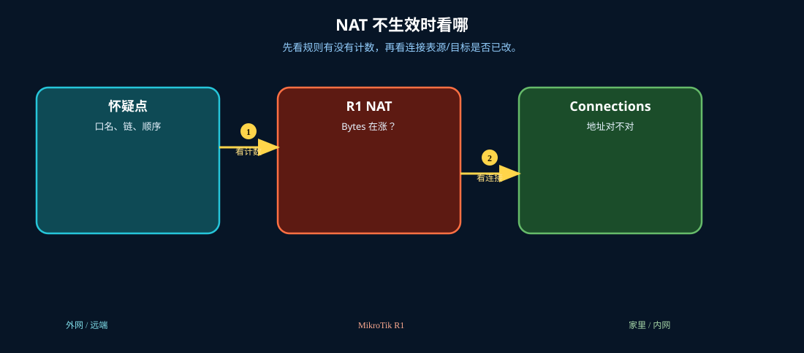

# NAT 排错

> 适用版本：RouterOS 7.x

## 目的

看计数器和连接跟踪。

## 网络

- 示例 LAN：`192.168.88.0/24`，网关 `192.168.88.1`，接口 `bridge`（改成你的口）
- WAN 示例：`pppoe-out1` 或 `ether1`
- 密码示例：`********`（填你自己的管理员密码）
- 身份示例：`R1`

## 先看懂

先看规则有没有计数，再看连接表源/目标是否已改。



<p align="center">图(0) NAT排错</p>

## 第1步：看 NAT 计数

WinBox：`IP → Firewall → NAT`

动作：Bytes/Packets 是否在涨。


<p align="center">图(1) 看NAT计数</p>


```routeros
/ip/firewall/nat/print stats
```

## 第2步：看 Connections

WinBox：`IP → Firewall → Connections`

动作：确认会话经过 srcnat/dstnat。


<p align="center">图(2) 看Connections</p>


```routeros
/ip/firewall/connection/print
```

## 检查

WinBox：有活跃连接且 NAT 计数增加

```routeros
/ip/firewall/nat/print stats
/ip/firewall/connection/print
```
