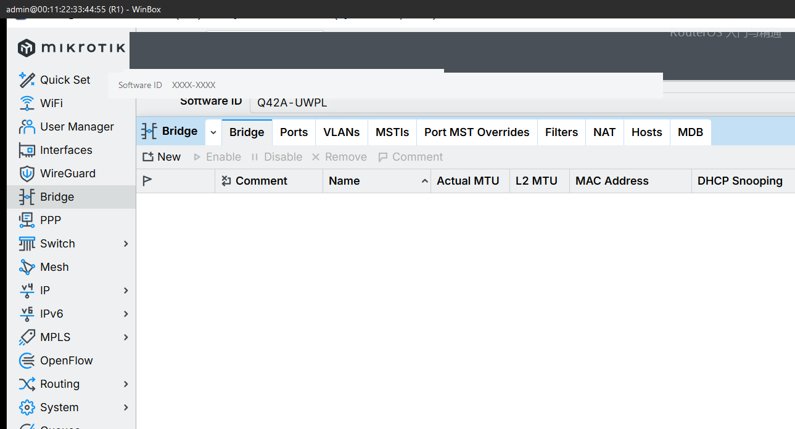

# NAT排错

> 适用版本：RouterOS 7.x  
> 管理工具：WinBox  
> 官方依据：[NAT](https://help.mikrotik.com/docs/spaces/ROS/pages/3211299/NAT)

## 目的

能 ping IP 不能上网，或只有一台能上网。

## 网络

- 示例 LAN：`192.168.88.1/24`，接口 `bridge`（改成你的口）
- WAN 示例口：`ether1`
- 密码示例：`********`（填你自己的）

## 第1步：看 NAT 计数

WinBox：`IP → Firewall → NAT`

Bytes 是否在涨。



```routeros
/ip/firewall/nat/print stats
```

## 检查

WinBox：`IP → Firewall → NAT`

```routeros
/ip/firewall/nat/print
```

## 常见问题

出接口填错最常见。

