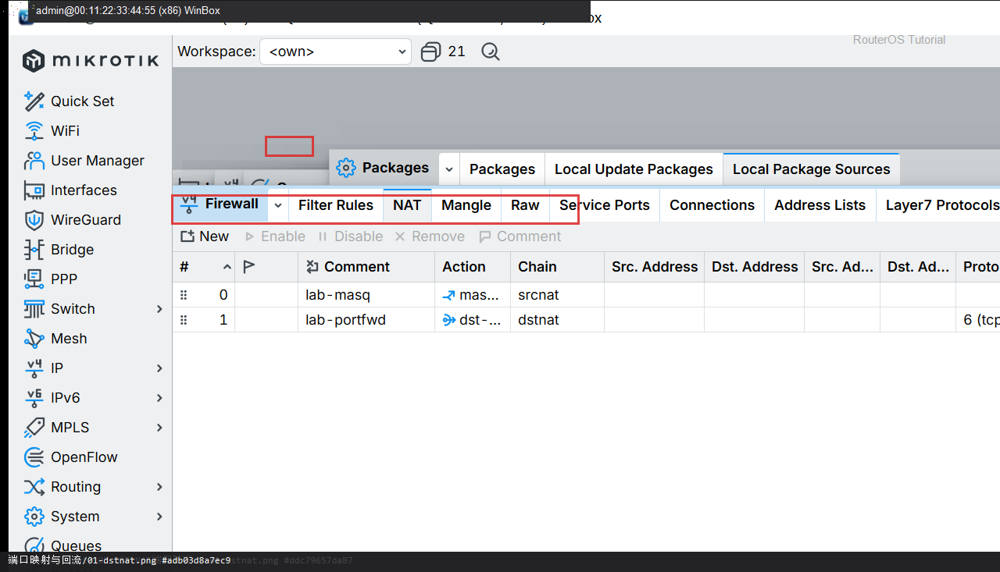
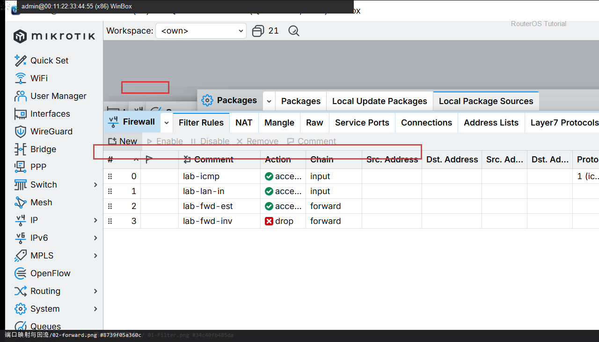
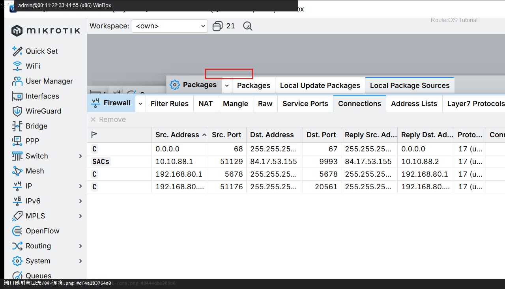

# 端口映射与回流

> 适用版本：RouterOS 7.x  
> 管理工具：WinBox  
> 官方依据：[NAT](https://help.mikrotik.com/docs/spaces/ROS/pages/3211299/NAT) · [Port forwarding](https://help.mikrotik.com/docs/spaces/RKB/pages/154042388/Port+forwarding)

## 目的

公网端口转到内网主机，并且 LAN 里用公网地址访问也能通（hairpin）。

## 网络

- LAN：`192.168.88.0/24`，网关 `192.168.88.1`，接口 `bridge`（改成你的口）
- WAN：`pppoe-out1` 或 `ether1`
- 公网示例用 TEST-NET：`203.0.113.10`；密码只写 `********`
- 身份示例：`R1`
- 内网主机：`192.168.88.10` 监听 TCP 80
- 公网侧：WAN 上 TCP 8080 → 内网 80

## 第1步：dst-nat 端口映射

WinBox：`IP → Firewall → NAT → +`

动作：Chain=dstnat，Protocol=tcp，Dst. Port=8080，In. Interface=pppoe-out1，Action=dst-nat，To Addresses=192.168.88.10，To Ports=80，Comment=lab-portfwd。



```routeros
/ip/firewall/nat/add chain=dstnat protocol=tcp dst-port=8080 in-interface=pppoe-out1 action=dst-nat to-addresses=192.168.88.10 to-ports=80 comment=lab-portfwd
```

## 第2步：forward 放行

WinBox：`IP → Firewall → Filter Rules`

动作：放行到 192.168.88.10:80 的转发。



```routeros
/ip/firewall/filter/add chain=forward dst-address=192.168.88.10 protocol=tcp dst-port=80 action=accept comment=lab-portfwd-fwd
```

## 第3步：hairpin（端口回流）

WinBox：`IP → Firewall → NAT → +`

动作：LAN 访问「公网 IP:8080」要回来：Chain=srcnat，Src. Address=192.168.88.0/24，Dst. Address=192.168.88.10，Protocol=tcp，Dst. Port=80，Out. Interface=bridge，Action=masquerade，Comment=lab-hairpin。


```routeros
/ip/firewall/nat/add chain=srcnat src-address=192.168.88.0/24 dst-address=192.168.88.10 protocol=tcp dst-port=80 out-interface=bridge action=masquerade comment=lab-hairpin
```

## 第4步：看连接

WinBox：`IP → Firewall → Connections`

动作：内外访问时都应看到到 192.168.88.10:80 的会话。



```routeros
/ip/firewall/nat/print where comment~"lab-"
/ip/firewall/connection/print where dst-address~"192.168.88.10"
```

## 检查

WinBox：外网和内网都能打开映射的服务

```routeros
/ip/firewall/nat/print where comment~"lab-"
```

## 常见问题

只做 dst-nat、不做 hairpin 时，LAN 用公网地址会失败。动态 WAN 不要把 dst-address 写成过期公网 IP，用 in-interface 更稳。
