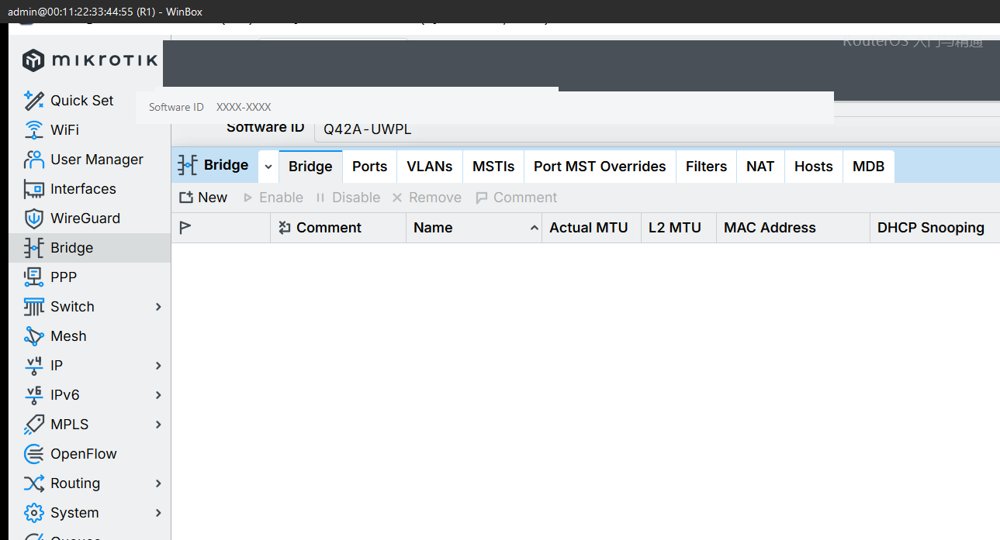

# 防火墙基本概念

> 适用版本：RouterOS 7.x  
> 管理工具：WinBox  
> 官方依据：[Filter](https://help.mikrotik.com/docs/spaces/ROS/pages/328020/Filter)

## 目的

input 保护路由器自己，forward 保护经过的流量。

## 网络

- 示例 LAN：`192.168.88.1/24`，接口 `bridge`（改成你的口）
- WAN 示例口：`ether1`
- 密码示例：`********`（填你自己的）

## 第1步：打开 Filter

WinBox：`IP → Firewall → Filter Rules`

看 Chain 列：input / forward / output。



```routeros
/ip/firewall/filter/print
```

## 检查

WinBox：`IP → Firewall → Filter Rules`

```routeros
/ip/firewall/filter/print
```

## 常见问题

规则从上往下匹配。

