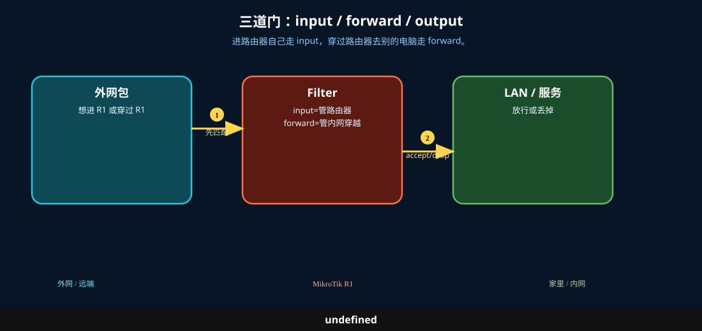
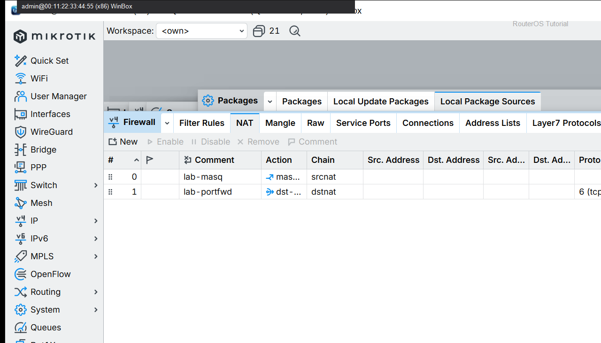

# 防火墙基本概念

> 适用版本：RouterOS 7.x

## 目的

先认 Filter / NAT / Connections。

## 网络

- 示例 LAN：`192.168.88.0/24`，网关 `192.168.88.1`，接口 `bridge`（改成你的口）
- WAN 示例：`pppoe-out1` 或 `ether1`
- 密码示例：`********`（填你自己的管理员密码）
- 身份示例：`R1`

## 先看懂

进路由器自己走 input，穿过路由器去别的电脑走 forward。



<p align="center">图(1) 防火墙概念</p>

## 第1步：打开 Filter

WinBox：`IP → Firewall → Filter Rules`

动作：认清 Chain=input/forward，Action=accept/drop。


<p align="center">图(2) 打开Filter</p>


```routeros
/ip/firewall/filter/print
```

## 第2步：对照 NAT

WinBox：`IP → Firewall → NAT`

动作：NAT 改地址，Filter 决定放行/丢弃。



<p align="center">图(3) 对照NAT</p>


```routeros
/ip/firewall/nat/print
```

## 检查

WinBox：能区分 Filter 与 NAT 页签

```routeros
/ip/firewall/filter/print
/ip/firewall/nat/print
```
