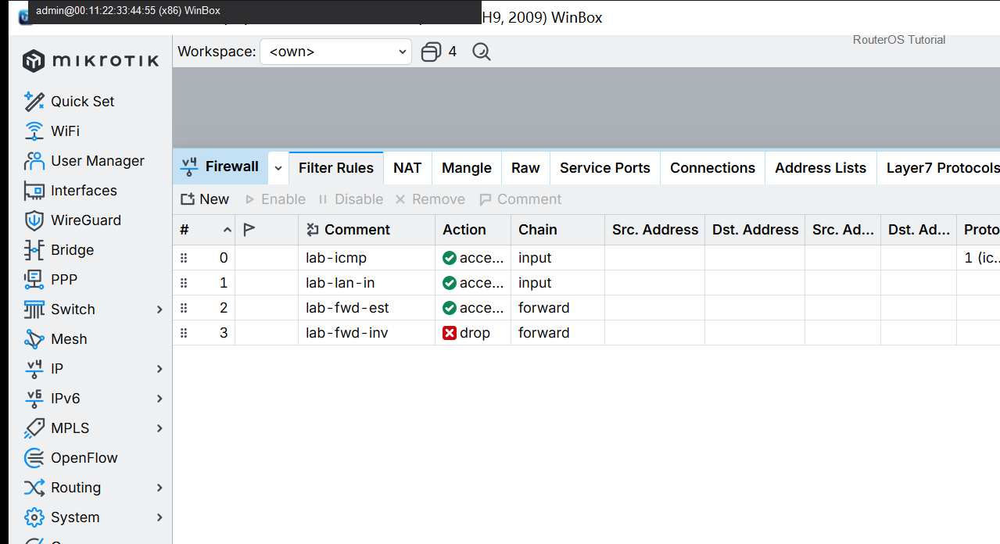

# 保护路由器 Input

> 适用版本：RouterOS 7.x  
> 管理工具：WinBox  
> 官方依据：[Filter](https://help.mikrotik.com/docs/spaces/ROS/pages/328122/Filter)

## 目的

先放行 ICMP 与 LAN，再考虑收紧。

## 网络

- 示例 LAN：`192.168.88.0/24`，网关 `192.168.88.1`，接口 `bridge`（改成你的口）
- WAN 示例：`pppoe-out1` 或 `ether1`
- 密码示例：`********`（填你自己的管理员密码）
- 身份示例：`R1`

## 第1步：放行 ICMP

WinBox：`Filter Rules → +`

动作：Chain=input，Protocol=icmp，Action=accept，Comment=lab-icmp。



```routeros
/ip/firewall/filter/add chain=input protocol=icmp action=accept comment=lab-icmp
```

## 第2步：放行 LAN

WinBox：`Filter Rules → +`

动作：Chain=input，In.Interface=bridge，Action=accept，Comment=lab-lan-in。


```routeros
/ip/firewall/filter/add chain=input in-interface=bridge action=accept comment=lab-lan-in
```

## 第3步：放行 established

WinBox：`Filter Rules → +`

动作：Chain=input，Connection State=established,related，Action=accept。


```routeros
/ip/firewall/filter/add chain=input connection-state=established,related action=accept comment=lab-est
```

## 第4步：可选丢弃其余

WinBox：`Filter Rules → +`

动作：Chain=input，Action=drop，先 Disabled 观察。


```routeros
/ip/firewall/filter/add chain=input action=drop comment=lab-drop-wan disabled=yes
```

## 检查

WinBox：LAN 仍能 WinBox

```routeros
/ip/firewall/filter/print where chain=input
```

## 常见问题

最后一条 drop 慎用。
