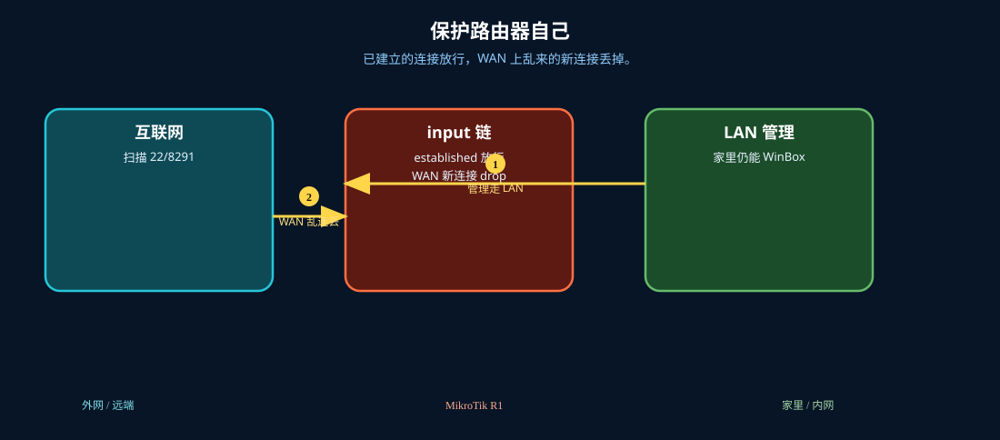

# 保护路由器 Input

> 适用版本：RouterOS 7.x

## 目的

保护路由器自身（input 链）。

## 网络

- 示例 LAN：`192.168.88.0/24`，网关 `192.168.88.1`，接口 `bridge`（改成你的口）
- WAN 示例：`pppoe-out1` 或 `ether1`
- 密码示例：`********`（填你自己的管理员密码）
- 身份示例：`R1`

## 先看懂

已建立的连接放行，WAN 上乱来的新连接丢掉。



<p align="center">图(1) 保护Input</p>

## 第1步：放行 ICMP

WinBox：`IP → Firewall → Filter Rules`

动作：Chain=input，Protocol=icmp，Action=accept，Comment=lab-icmp。


<p align="center">图(2) 放行ICMP</p>


```routeros
/ip/firewall/filter/add chain=input protocol=icmp action=accept comment=lab-icmp
```

## 第2步：放行 LAN 管理

WinBox：`IP → Firewall → Filter Rules`

动作：Chain=input，Src. Address=192.168.88.0/24，Action=accept，Comment=lab-lan-in。


<p align="center">图(3) 放行LAN管理</p>


```routeros
/ip/firewall/filter/add chain=input src-address=192.168.88.0/24 action=accept comment=lab-lan-in
```

## 第3步：放行已建立

WinBox：`IP → Firewall → Filter Rules`

动作：connection-state=established,related。


<p align="center">图(4) 放行已建立</p>


```routeros
/ip/firewall/filter/print where chain=input
```

## 第4步：看整体

WinBox：`IP → Firewall → Filter Rules`

动作：确认 input 规则顺序合理。


<p align="center">图(5) 看整体</p>


```routeros
/ip/firewall/filter/print where chain=input
```

## 检查

WinBox：input 有 lab-icmp / lab-lan-in

```routeros
/ip/firewall/filter/print where chain=input
```

## 常见问题

容易忽略：最后再考虑 drop，防把自己锁死。
