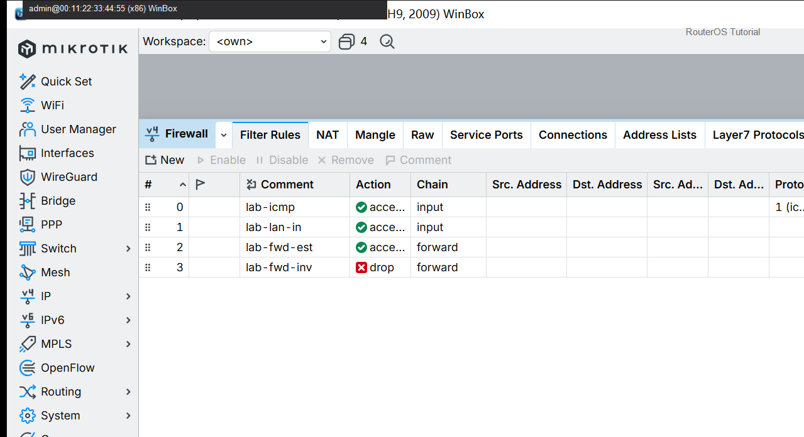

# 保护内网 Forward

> 适用版本：RouterOS 7.x  
> 管理工具：WinBox  
> 官方依据：[Filter](https://help.mikrotik.com/docs/spaces/ROS/pages/328122/Filter)

## 目的

转发链放行已建立、丢掉 invalid。

## 网络

- 示例 LAN：`192.168.88.0/24`，网关 `192.168.88.1`，接口 `bridge`（改成你的口）
- WAN 示例：`pppoe-out1` 或 `ether1`
- 密码示例：`********`（填你自己的管理员密码）
- 身份示例：`R1`

## 第1步：放行 established

WinBox：`Filter Rules → +`

动作：Chain=forward，Connection State=established,related，Action=accept，Comment=lab-fwd-est。


```routeros
/ip/firewall/filter/add chain=forward connection-state=established,related action=accept comment=lab-fwd-est
```

## 第2步：丢弃 invalid

WinBox：`Filter Rules → +`

动作：Chain=forward，Connection State=invalid，Action=drop，Comment=lab-fwd-inv。


```routeros
/ip/firewall/filter/add chain=forward connection-state=invalid action=drop comment=lab-fwd-inv
```

## 第3步：放行 LAN 出网

WinBox：`Filter Rules → +`

动作：Chain=forward，In.Interface=bridge，Action=accept。



```routeros
/ip/firewall/filter/add chain=forward in-interface=bridge action=accept comment=lab-fwd-lan
```

## 检查

WinBox：内网仍能上网

```routeros
/ip/firewall/filter/print where chain=forward
```

## 常见问题

顺序：established → invalid → 业务。
