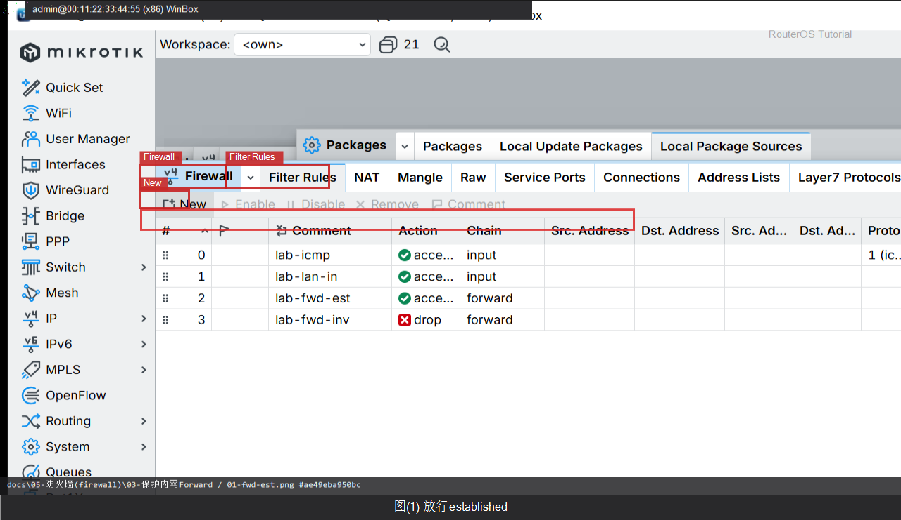
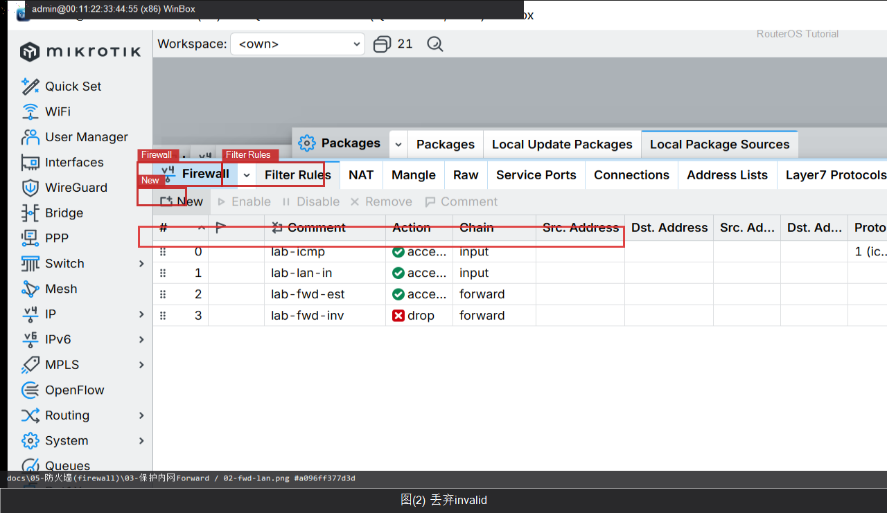
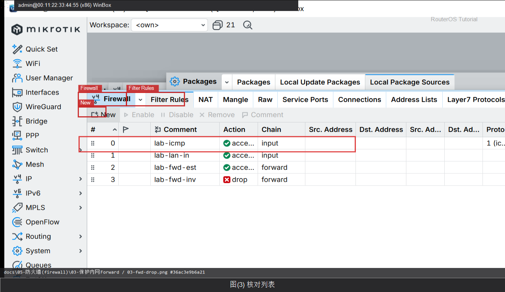

# 保护内网 Forward

> 适用版本：RouterOS 7.x


## 目的

控制转发流量。

## 网络

- 示例 LAN：`192.168.88.0/24`，网关 `192.168.88.1`，接口 `bridge`（改成你的口）
- WAN 示例：`pppoe-out1` 或 `ether1`
- 密码示例：`********`（填你自己的管理员密码）
- 身份示例：`R1`

## 第1步：放行 established

WinBox：`IP → Firewall → Filter Rules`

动作：Chain=forward，Action=accept，Comment=lab-fwd-est。



```routeros
/ip/firewall/filter/add chain=forward action=accept comment=lab-fwd-est
```

## 第2步：丢弃 invalid

WinBox：`IP → Firewall → Filter Rules`

动作：Chain=forward，Action=drop，Comment=lab-fwd-inv。



```routeros
/ip/firewall/filter/add chain=forward action=drop comment=lab-fwd-inv
```

## 第3步：核对列表

WinBox：`IP → Firewall → Filter Rules`

动作：确认 forward 规则顺序。



```routeros
/ip/firewall/filter/print where chain=forward
```

## 检查

WinBox：forward 有 lab-fwd-*

```routeros
/ip/firewall/filter/print where chain=forward
```
