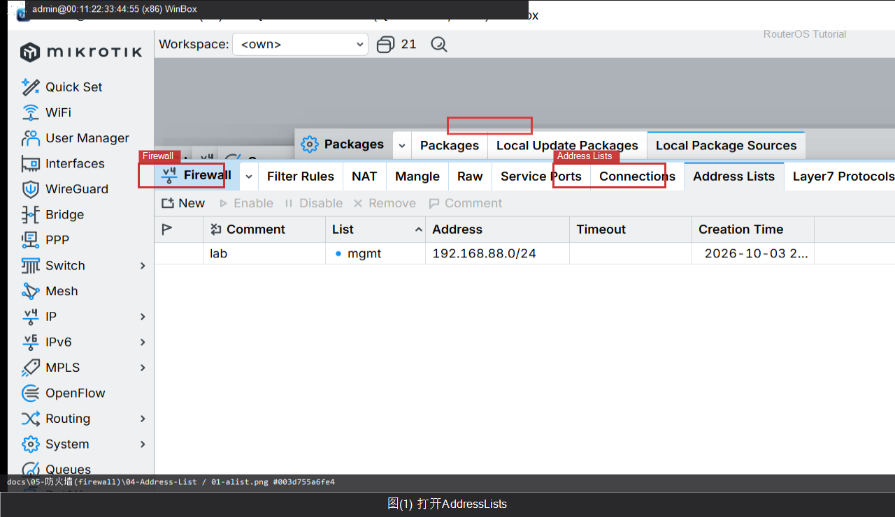
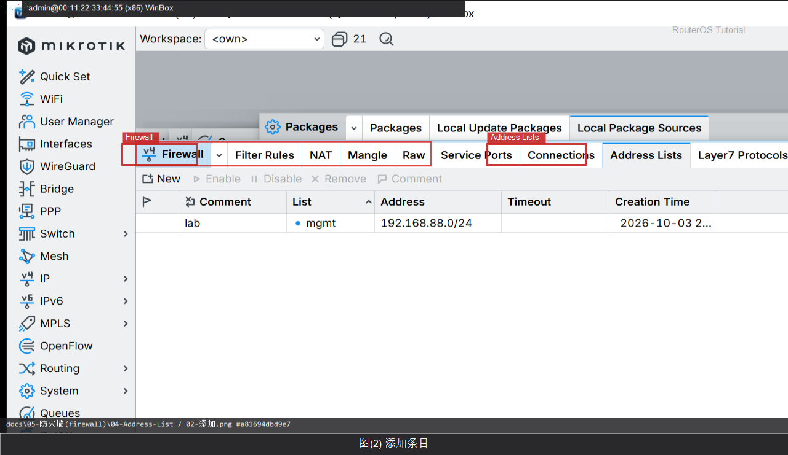

# Address List

> 适用版本：RouterOS 7.x


## 目的

用地址列表复用源/目的网段。

## 网络

- 示例 LAN：`192.168.88.0/24`，网关 `192.168.88.1`，接口 `bridge`（改成你的口）
- WAN 示例：`pppoe-out1` 或 `ether1`
- 密码示例：`********`（填你自己的管理员密码）
- 身份示例：`R1`

## 第1步：打开 Address Lists

WinBox：`IP → Firewall → Address Lists`

动作：查看已有列表。901 有 mgmt=192.168.88.0/24。



```routeros
/ip/firewall/address-list/print
```

## 第2步：添加条目

WinBox：`IP → Firewall → Address Lists → +`

动作：List=mgmt，Address=192.168.88.0/24，Comment=lab。



```routeros
/ip/firewall/address-list/add list=mgmt address=192.168.88.0/24 comment=lab
```

## 检查

WinBox：列表中有 mgmt

```routeros
/ip/firewall/address-list/print where list=mgmt
```
