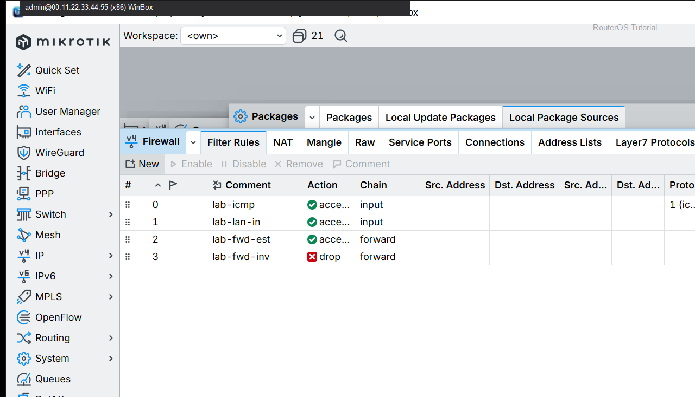
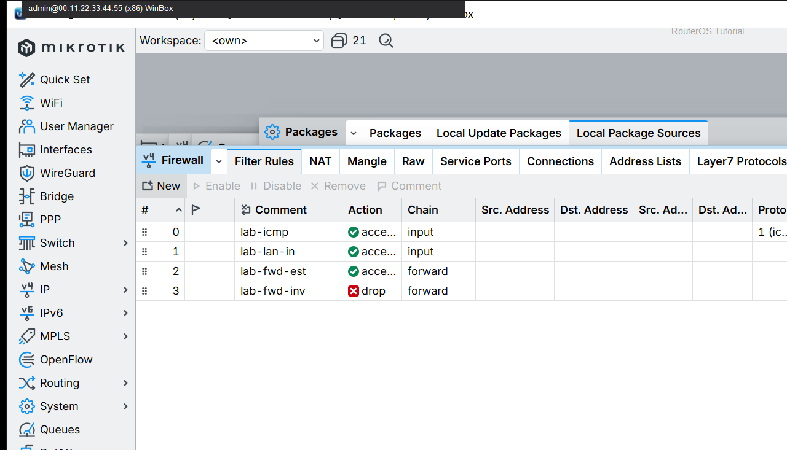

# 端口放行

> 适用版本：RouterOS 7.x  
> 管理工具：WinBox  
> 官方依据：[Filter](https://help.mikrotik.com/docs/spaces/ROS/pages/328166/Filter)

## 目的

放行管理端口（示例 WinBox）。

## 网络

- 示例 LAN：`192.168.88.0/24`，网关 `192.168.88.1`，接口 `bridge`（改成你的口）
- WAN 示例：`pppoe-out1` 或 `ether1`
- 密码示例：`********`（填你自己的管理员密码）
- 身份示例：`R1`

## 第1步：看服务端口

WinBox：`IP → Services`

动作：确认 winbox=8291。



```routeros
/ip/service/print where name=winbox
```

## 第2步：Filter 放行

WinBox：`IP → Firewall → Filter Rules`

动作：如需公网管理再放行（更推荐 VPN）。



```routeros
/ip/firewall/filter/print where chain=input
```

## 检查

WinBox：可信网段能连 WinBox

```routeros
/ip/service/print where name=winbox
```

## 常见问题

尽量不要对全网开放 8291。
