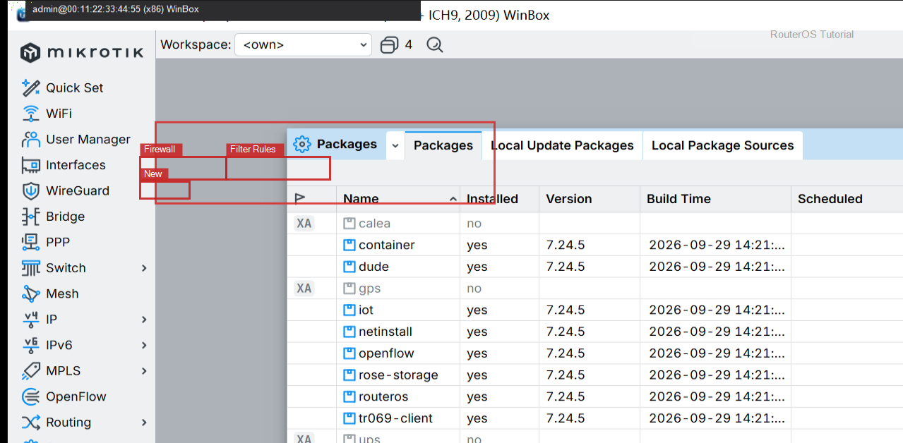
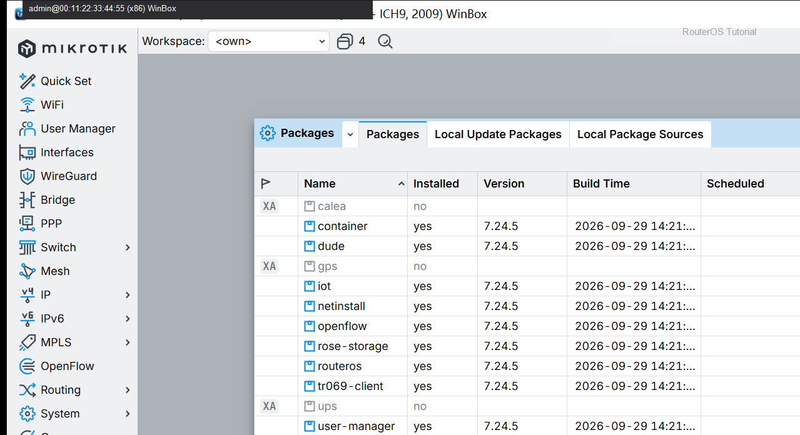

# 端口封禁

> 适用版本：RouterOS 7.x  
> 管理工具：WinBox  
> 官方依据：[Services](https://help.mikrotik.com/docs/spaces/ROS/pages/328166/Services)

## 目的

关掉不用的服务。

## 网络

- 示例 LAN：`192.168.88.0/24`，网关 `192.168.88.1`，接口 `bridge`（改成你的口）
- WAN 示例：`pppoe-out1` 或 `ether1`
- 密码示例：`********`（填你自己的管理员密码）
- 身份示例：`R1`

## 第1步：打开 Services

WinBox：`IP → Services`

动作：禁用 telnet/ftp/www 等不需要的服务。



```routeros
/ip/service/print
```

## 第2步：禁用危险服务

WinBox：`IP → Services`

动作：选中后 Disable。



```routeros
/ip/service/disable [find name~"telnet|ftp|www"]
```

## 检查

WinBox：危险服务为 disabled

```routeros
/ip/service/print
```

## 常见问题

改完确认还能用 WinBox/SSH。
