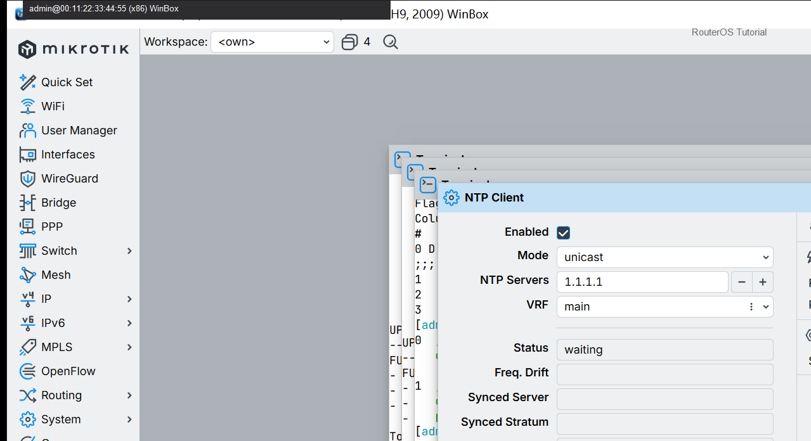
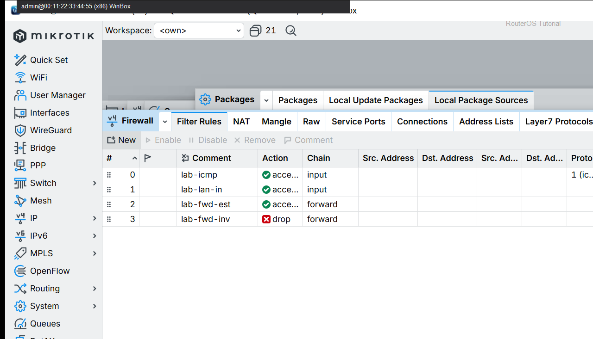

# 查看防火墙日志

> 适用版本：RouterOS 7.x

## 目的

用日志确认规则是否命中。

## 网络

- 示例 LAN：`192.168.88.0/24`，网关 `192.168.88.1`，接口 `bridge`（改成你的口）
- WAN 示例：`pppoe-out1` 或 `ether1`
- 密码示例：`********`（填你自己的管理员密码）
- 身份示例：`R1`

## 第1步：看 Log

WinBox：`Log`

动作：筛选 firewall 相关条目。



```routeros
/log/print where topics~"firewall"
```

## 第2步：看规则计数

WinBox：`IP → Firewall → Filter Rules`

动作：Bytes/Packets 是否增加。



```routeros
/ip/firewall/filter/print stats
```

## 检查

WinBox：有相关日志或规则计数增加

```routeros
/log/print
/ip/firewall/filter/print stats
```
