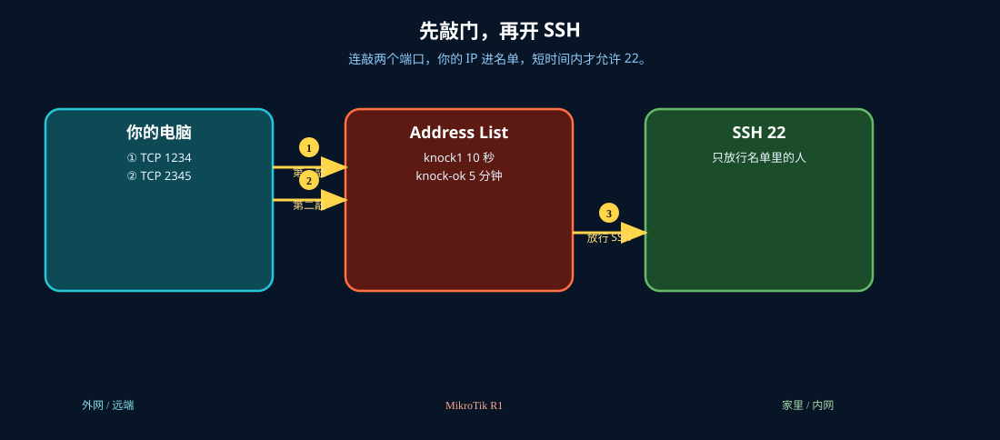
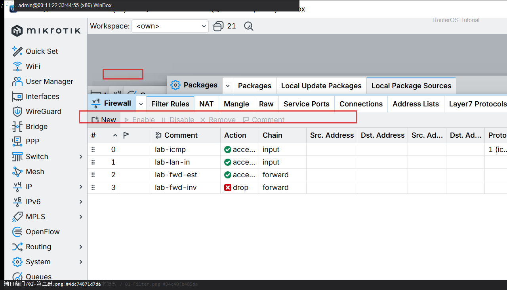
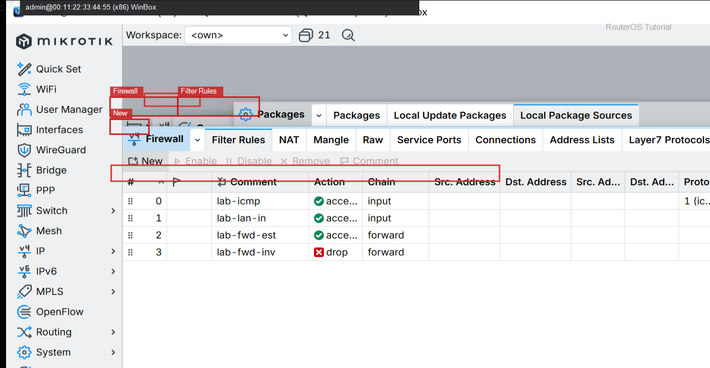
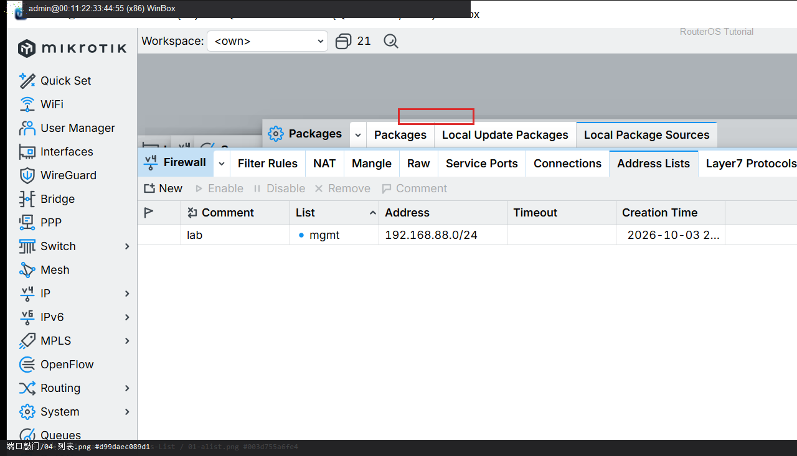

# 端口敲门

> 适用版本：RouterOS 7.x

## 目的

连敲两个端口后，才临时允许 SSH。RouterOS 没有独立「敲门」菜单，用 Address List + 超时。

## 网络

- LAN：`192.168.88.0/24`，网关 `192.168.88.1`，接口 `bridge`（改成你的口）
- WAN：`pppoe-out1` 或 `ether1`
- 公网示例用 TEST-NET：`203.0.113.10`；密码只写 `********`
- 身份示例：`R1`
- 敲门：TCP 1234 → TCP 2345，10 秒内完成
- 放行：TCP 22，来源在列表 knock-ok 里

## 先看懂

连敲两个端口，你的 IP 进名单，短时间内才允许 22。



<p align="center">图(1) 端口敲门</p>

## 第1步：第一敲写入列表

WinBox：`IP → Firewall → Filter Rules → +`

动作：Chain=input，Protocol=tcp，Dst. Port=1234，Action=add src to address list，List=knock1，Timeout=10s。不要 accept。


<p align="center">图(2) 第一敲写入列表</p>


```routeros
/ip/firewall/filter/add chain=input protocol=tcp dst-port=1234 action=add-src-to-address-list address-list=knock1 address-list-timeout=10s comment=lab-knock1
```

## 第2步：第二敲升级列表

WinBox：`IP → Firewall → Filter Rules → +`

动作：Src. Address List=knock1，Dst. Port=2345，Action=add src to address list，List=knock-ok，Timeout=5m。



<p align="center">图(3) 第二敲升级列表</p>


```routeros
/ip/firewall/filter/add chain=input protocol=tcp dst-port=2345 src-address-list=knock1 action=add-src-to-address-list address-list=knock-ok address-list-timeout=5m comment=lab-knock2
```

## 第3步：放行已敲门的 SSH

WinBox：`IP → Firewall → Filter Rules → +`

动作：Src. Address List=knock-ok，Dst. Port=22，Action=accept。默认 drop 放在后面。



<p align="center">图(4) 放行已敲门的SSH</p>


```routeros
/ip/firewall/filter/add chain=input protocol=tcp dst-port=22 src-address-list=knock-ok action=accept comment=lab-knock-ssh
```

## 第4步：看 Address Lists

WinBox：`IP → Firewall → Address Lists`

动作：敲门成功后会出现你的源 IP。



<p align="center">图(5) 看AddressLists</p>


```routeros
/ip/firewall/address-list/print where list~"knock"
```

## 检查

WinBox：敲完 1234、2345 后 Address Lists 有 knock-ok，SSH 能连

```routeros
/ip/firewall/filter/print where comment~"knock"
/ip/firewall/address-list/print
```

## 常见问题

容易忽略：先保证 LAN 仍能 SSH，避免把自己锁死。敲门端口不要用真实业务口。
