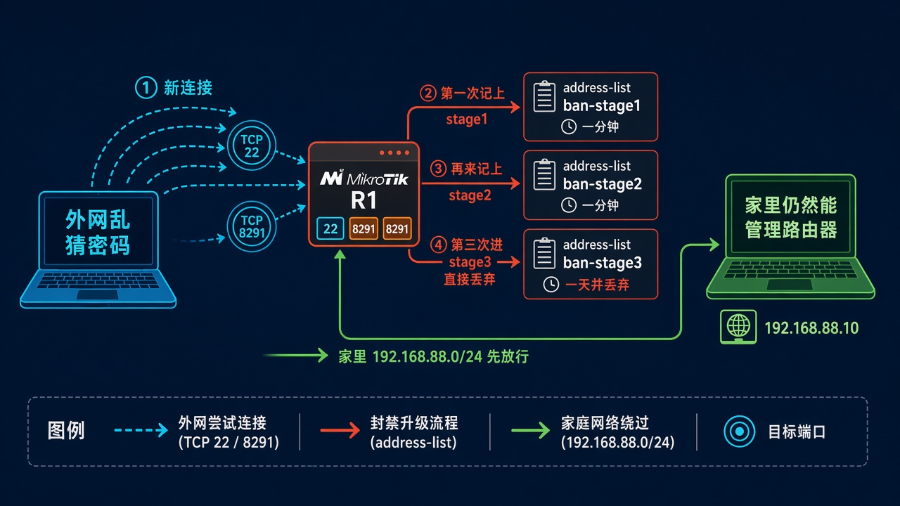
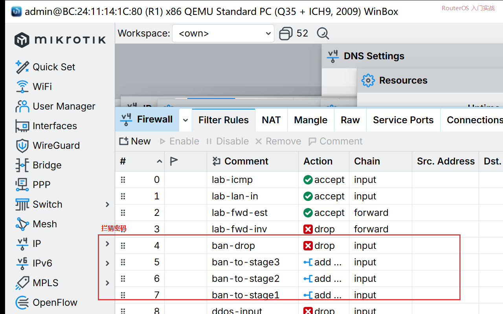
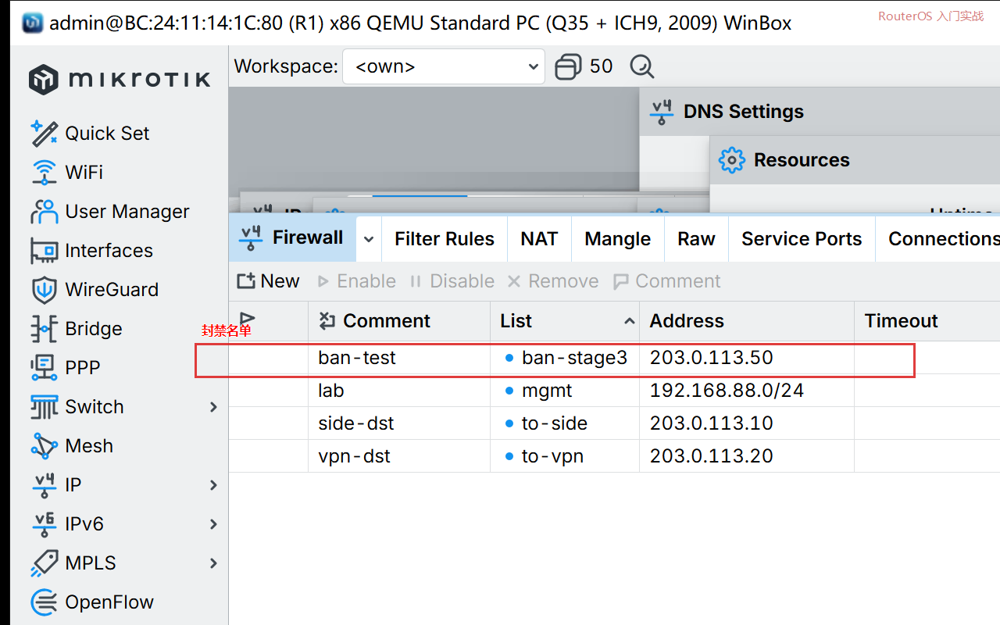

# 第 57 章：让乱猜密码的地址被临时拦住

> 适用版本：RouterOS 7.x

## 目的

外网对 SSH、WinBox 连三次就把这个来源丢掉一天。家里 `192.168.88.0/24` 仍然能管路由器。

这是防守。不要拿去扫别人。

## 网络

- LAN：`192.168.88.0/24`，网关 `192.168.88.1`
- 管端口：TCP `22`、`8291`
- 测试名单示例：`203.0.113.50`（不要填家里电脑）
- 身份示例：`R1`

## 网络拓扑及原理图

新连接先记 stage1，再来记 stage2，第三次进 stage3 直接丢。家里网段先放行。



<p align="center">图(1) 拦猜密码</p>

## 第1步：第三次就丢

WinBox：`IP → Firewall → Filter Rules → +`

动作：Chain=`input`，Protocol=`tcp`，Dst. Port=`22,8291`，Src. Address List=`ban-stage3`，Action=`drop`。把这条放在后面几条「记名单」的前面。家里那条 `in-interface=bridge` 的放行要在它们上面。



<p align="center">图(2) 丢弃</p>

```routeros
/ip/firewall/filter/add chain=input protocol=tcp dst-port=22,8291 src-address-list=ban-stage3 action=drop comment=ban-drop
```

## 第2步：记上三级名单

WinBox：同一窗口再加三条。Chain=`input`，Protocol=`tcp`，Dst. Port=`22,8291`，Connection State=`new`。

- 已在 `ban-stage2`：Action=`add src to address list`，Address List=`ban-stage3`，Timeout=`1d`
- 已在 `ban-stage1`：Address List=`ban-stage2`，Timeout=`1m`
- 谁都不在：Address List=`ban-stage1`，Timeout=`1m`

顺序从上到下：丢弃 → 升到 stage3 → 升到 stage2 → 记入 stage1。

```routeros
/ip/firewall/filter/add chain=input protocol=tcp dst-port=22,8291 connection-state=new src-address-list=ban-stage2 action=add-src-to-address-list address-list=ban-stage3 address-list-timeout=1d comment=ban-to-stage3
/ip/firewall/filter/add chain=input protocol=tcp dst-port=22,8291 connection-state=new src-address-list=ban-stage1 action=add-src-to-address-list address-list=ban-stage2 address-list-timeout=1m comment=ban-to-stage2
/ip/firewall/filter/add chain=input protocol=tcp dst-port=22,8291 connection-state=new action=add-src-to-address-list address-list=ban-stage1 address-list-timeout=1m comment=ban-to-stage1
```

## 第3步：用示例地址看名单

WinBox：`IP → Firewall → Address Lists`

动作：可临时加 List=`ban-stage3`，Address=`203.0.113.50`，看表里出现这一行。看完就删掉，别挡住自己。



<p align="center">图(3) 名单</p>

```routeros
/ip/firewall/address-list/add list=ban-stage3 address=203.0.113.50 comment=ban-test
/ip/firewall/address-list/print where list~"ban-stage"
```

## 检查

家里电脑仍能打开 WinBox。`Address Lists` 里能看到 `ban-stage1/2/3`。

```routeros
/ip/firewall/filter/print where comment~"ban-"
```

## 常见问题

这三条「记名单」若放在 `drop all` 后面，永远计不上数。家里网段的放行必须在它们上面，否则你自己连三次也会进名单。
