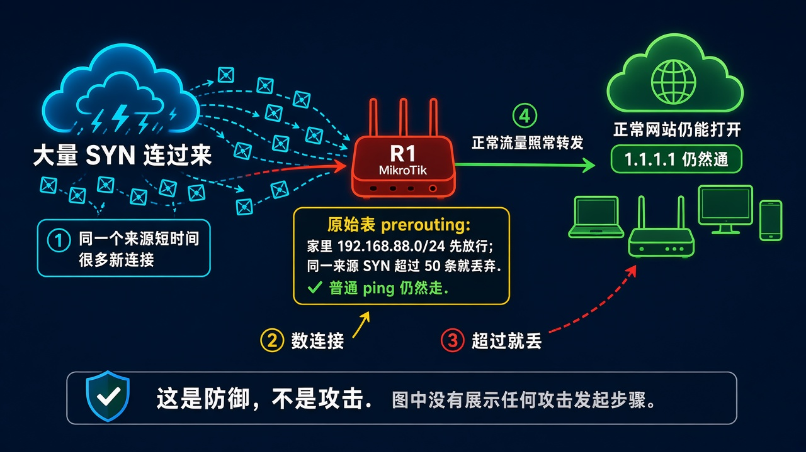
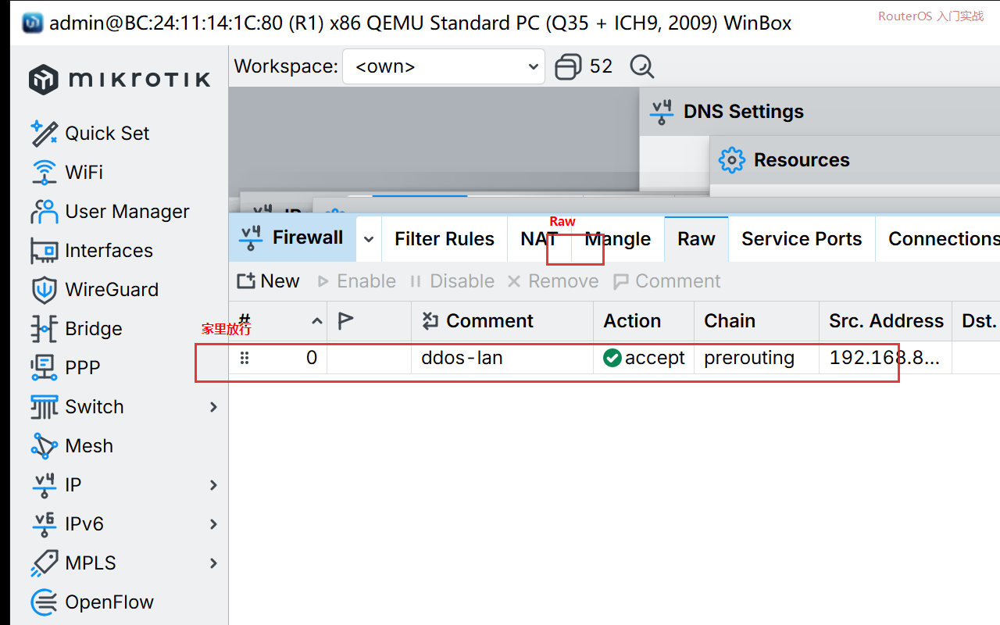
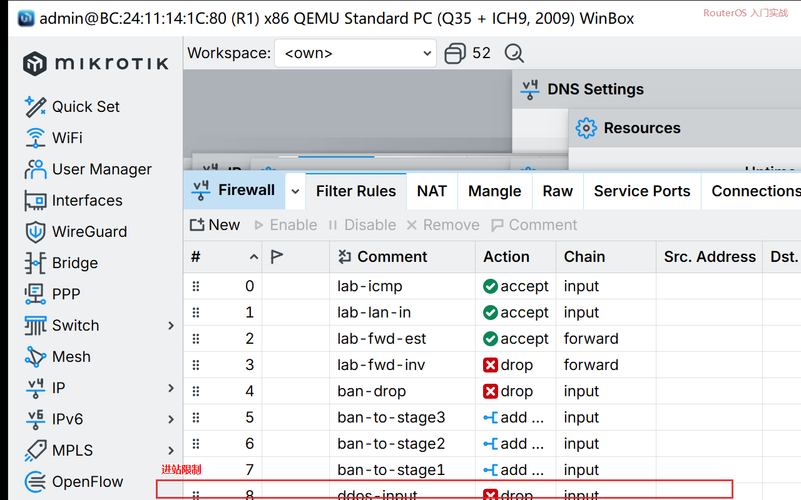

# 第 60 章：让路由器挡住短时大量 SYN 冲击

> 适用版本：RouterOS 7.x

## 目的

同一个来源短时间打来大量 SYN 时丢掉，家里上网和 ping 仍然通。

这是防守。课文不写怎么打。

## 网络

- LAN：`192.168.88.0/24` 先放行
- WAN 示例口：`pppoe-out1` 或 `ether1`
- 身份示例：`R1`

## 网络拓扑及原理图

原始表先放家里。再数 SYN。超过就丢。普通网页和 ping 不走这条。



<p align="center">图(1) 挡住连接洪水</p>

## 第1步：家里先放行

WinBox：`IP → Firewall → Raw → +`

动作：Chain=`prerouting`，Src. Address=`192.168.88.0/24`，Action=`accept`。



<p align="center">图(2) Raw 放行家里</p>

```routeros
/ip/firewall/raw/add chain=prerouting src-address=192.168.88.0/24 action=accept comment=ddos-lan
```

## 第2步：SYN 太多就丢

WinBox：还在 Raw，再 `+`

动作：Chain=`prerouting`，Protocol=`tcp`，TCP Flags=`syn`，Action=`drop`。Connection Limit=`50`，Netmask=`32`（同一来源）。

```routeros
/ip/firewall/raw/add chain=prerouting protocol=tcp tcp-flags=syn connection-limit=50,32 action=drop comment=ddos-syn
```

## 第3步：进站新连接也限一层

WinBox：`IP → Firewall → Filter Rules → +`

动作：Chain=`input`，Protocol=`tcp`，Action=`drop`，Connection Limit=`30,32`。放在家里放行规则下面。



<p align="center">图(3) 进站限制</p>

```routeros
/ip/firewall/filter/add chain=input protocol=tcp connection-limit=30,32 action=drop comment=ddos-input
```

## 第4步：打开 SYN Cookie

WinBox：`IP → Settings`

动作：勾 `TCP SynCookies`。Apply。

```routeros
/ip/settings/set tcp-syncookies=yes
```

## 检查

家里电脑打开网页应正常。路由器上 ping 外网应通。

```routeros
/ping 1.1.1.1 count=2
/ip/firewall/raw/print
/ip/settings/print
```

## 常见问题

Connection Limit 设得太小，家里一台电脑同时开很多网页也会误伤。先从 `50,32` 看，再按你家流量改。
