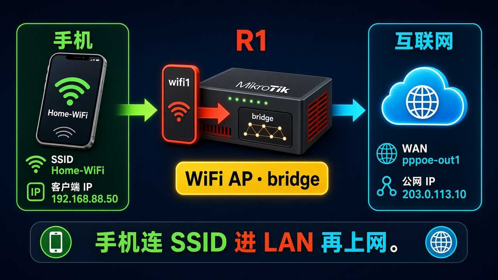

# 家里 Wi-Fi

> 适用版本：RouterOS 7.x

## 目的

在带无线网卡的板子上开家里 SSID，手机连上走 LAN。

## 网络

- 示例 LAN：`192.168.88.0/24`，网关 `192.168.88.1`，接口 `bridge`（改成你的口）
- WAN 示例：`pppoe-out1` 或 `ether1`
- 密码示例：`********`（填你自己的管理员密码）
- 身份示例：`R1`

没有无线网卡的 x86 虚拟机没有 radio，换 hAP / Audience 这类板子做。菜单是 `WiFi`（wifi-qcom），不是旧的 `Wireless`。

## 先看懂

手机连 R1 的 SSID，流量进 bridge，再走家里上网。



<p align="center">图(1) 家里 Wi-Fi</p>

## 第1步：加安全配置

WinBox：`WiFi → Security → +`

动作：Name=`sec-home`，Authentication Types 勾 `WPA2 PSK` 和 `WPA3 PSK`，Passphrase 填你自己的 Wi-Fi 密码（教程里写成 `********`），WPS=`disabled`。


<p align="center">图(2) 安全配置</p>

```routeros
/interface/wifi/security/add name=sec-home authentication-types=wpa2-psk,wpa3-psk passphrase="********" wps=disable
```

## 第2步：加配置档案

WinBox：`WiFi → Configuration → +`

动作：Name=`cfg-home`，SSID=`Home-WiFi`，Country=`China`，Security=`sec-home`。


<p align="center">图(3) 配置档案</p>

```routeros
/interface/wifi/configuration/add name=cfg-home ssid=Home-WiFi country=China security=sec-home
```

## 第3步：套到 wifi1 并进桥

WinBox：`WiFi → WiFi → 双击 wifi1；再 Bridge → Ports → +`

动作：Configuration=`cfg-home`，Disabled 去掉。把 `wifi1` 加进 `bridge`。


<p align="center">图(4) wifi1进桥</p>

```routeros
/interface/wifi/set wifi1 configuration=cfg-home disabled=no
/interface/bridge/port/add bridge=bridge interface=wifi1 comment=lab-wifi
```

## 检查

WinBox：wifi1 Running，手机能拿到 `192.168.88.0/24` 地址

```routeros
/interface/wifi/print
/interface/bridge/port/print where interface=wifi1
```

## 常见问题

SSID 出来但没地址：确认 wifi1 已经在 bridge 上，DHCP 绑的是 bridge。
