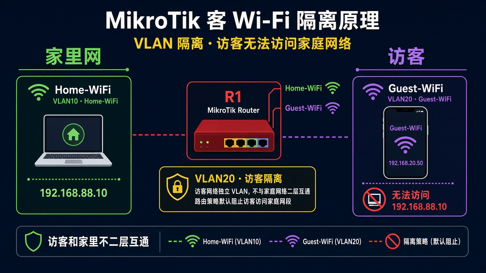
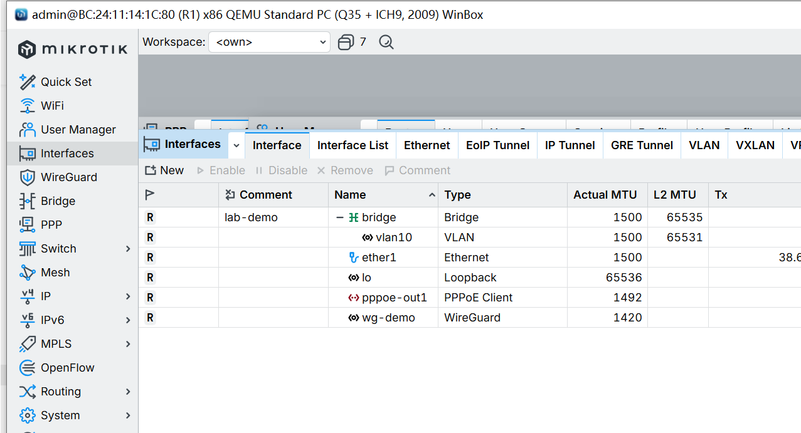

# 访客 Wi-Fi

> 适用版本：RouterOS 7.x

## 目的

再开一个访客 SSID，和家里网段分开。

## 网络

- 示例 LAN：`192.168.88.0/24`，网关 `192.168.88.1`，接口 `bridge`（改成你的口）
- WAN 示例：`pppoe-out1` 或 `ether1`
- 密码示例：`********`（填你自己的管理员密码）
- 身份示例：`R1`

访客网段示例：`192.168.20.0/24`。本课用虚拟 AP + VLAN 20。

## 网络拓扑及原理图

家里 SSID 走家里网段，访客 SSID 走 VLAN20，互不二层互通。



<p align="center">图(1) 访客 Wi-Fi</p>

## 第1步：访客安全和配置

WinBox：`WiFi → Security / Configuration → +`

动作：Security Name=`sec-guest`，口令另设。Configuration Name=`cfg-guest`，SSID=`Guest-WiFi`，Country=`China`。Datapath 打开 client isolation。



<p align="center">图(2) 访客配置</p>

```routeros
/interface/wifi/security/add name=sec-guest authentication-types=wpa2-psk,wpa3-psk passphrase="********" wps=disable
/interface/wifi/datapath/add name=dp-guest client-isolation=yes
/interface/wifi/configuration/add name=cfg-guest ssid=Guest-WiFi country=China security=sec-guest datapath=dp-guest
```

## 第2步：加虚拟 AP

WinBox：`WiFi → WiFi → +`

动作：Name=`wifi-guest`，Master Interface=`wifi1`，Configuration=`cfg-guest`，Disabled 去掉。


<p align="center">图(3) 虚拟AP</p>

```routeros
/interface/wifi/add name=wifi-guest master-interface=wifi1 configuration=cfg-guest disabled=no
```

## 第3步：访客进 VLAN

WinBox：`Bridge → Ports / VLANs；IP → Addresses`

动作：wifi-guest 的 PVID=`20`。再给 `vlan20` 配 `192.168.20.1/24` 和单独 DHCP。


<p align="center">图(4) 访客VLAN</p>

```routeros
/interface/vlan/add name=vlan20 vlan-id=20 interface=bridge
/ip/address/add address=192.168.20.1/24 interface=vlan20 comment=lab-guest
/interface/bridge/port/add bridge=bridge interface=wifi-guest pvid=20 comment=lab-guest
```

## 检查

WinBox：能连 Guest-WiFi，地址是 `192.168.20.x`，ping 不通 `192.168.88.10`

```routeros
/interface/wifi/print
/ip/address/print where comment=lab-guest
```

## 常见问题

访客还能访问家里电脑：检查 PVID / VLAN filtering 有没有打开。
