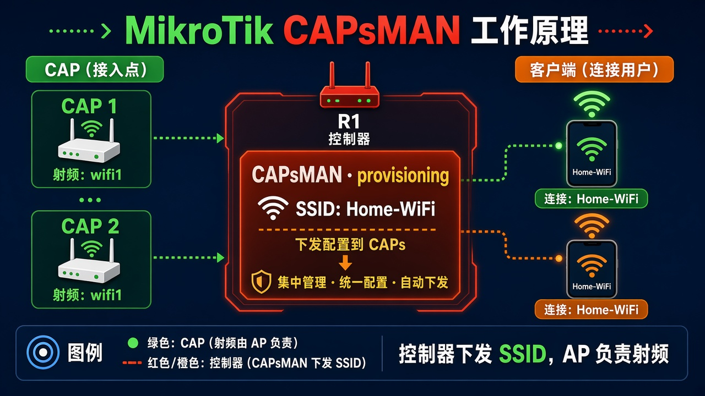

# 第 26 章：让一台路由器统一管多台 AP

> 适用版本：RouterOS 7.x

## 目的

一台当控制器，其它 AP 自动领 SSID。

## 网络

- 示例 LAN：`192.168.88.0/24`，网关 `192.168.88.1`，接口 `bridge`（改成你的口）
- WAN 示例：`pppoe-out1` 或 `ether1`
- 密码示例：`********`（填你自己的管理员密码）
- 身份示例：`R1`

控制器和管理口在同一二层。CAP 用 `wifi-qcom`。旧 Wireless 的 CAPsMAN 管不了新 WiFi。

## 网络拓扑及原理图

控制器下发配置，墙上 AP 只负责射频。



<p align="center">图(1) CAPsMAN</p>

## 第1步：控制器：安全 + 配置 + 下发

WinBox：`WiFi → Security / Configuration / Provisioning`

动作：先做 `sec-home`、`cfg-home`（SSID=`Home-WiFi`，Country=`China`）。Provisioning：Action=`create dynamic enabled`，Master Configuration=`cfg-home`。然后打开 CAPsMAN。


<p align="center">图(2) 下发规则</p>

```routeros
/interface/wifi/security/add name=sec-home authentication-types=wpa2-psk,wpa3-psk passphrase="********" wps=disable
/interface/wifi/configuration/add name=cfg-home ssid=Home-WiFi country=China security=sec-home
/interface/wifi/provisioning/add action=create-dynamic-enabled master-configuration=cfg-home
/interface/wifi/capsman/set enabled=yes ca-certificate=auto
```

## 第2步：CAP：加入控制器

WinBox：`在 AP 上：WiFi → CAP`

动作：Enabled 勾上。Discovery Interfaces 选 CAP 的桥。wifi1/wifi2 的 Configuration Manager=`capsman`。


<p align="center">图(3) CAP加入</p>

```routeros
/interface/wifi/cap/set enabled=yes discovery-interfaces=bridge
/interface/wifi/set [find default-name=wifi1] configuration.manager=capsman disabled=no
/interface/wifi/set [find default-name=wifi2] configuration.manager=capsman disabled=no
```

## 检查

WinBox：控制器上出现动态 wifi 接口，手机能搜到 Home-WiFi

```routeros
/interface/wifi/print
/interface/wifi/radio/print
```

## 常见问题

CAP 加不进去：两边要二层通，控制器 CAPsMAN 已 Enabled。
